# LambdaSpeak 3
## A Modern-Vintage Speech Synthesizer, PCM Sample Player, Drum Computer, Serial Interface, MP3 Player, MIDI Interface, and Real Time Clock for the Amstrad / Schneider CPC  
#### Hardware Design & LambdaSpeak Firmware: [Michael Wessel](https://www.michael-wessel.info/) 
#### LambdaSpeak CPC ROM and RSX: [Dr. Stefan Stumpferl (TFM)](http://futureos.cpc-live.com) 
#### Technical Guidance: Bryce from the [CPC Wiki Board](http://www.cpcwiki.eu/forum/index.php)
#### Additional Ideas: Zhulien from the [CPC Wiki Board](http://www.cpcwiki.eu/forum/index.php)
#### License: GPL 3

### Introduction

LambdaSpeak 3 is a versatile hardware extension for the Amstrad / Schneider CPC 464 (Plus), 664, and 6128 (Plus) home computer, with a focus on speech synthesis and PCM sample playing. 

It offers:

  1. **DECtalk-based Text-to-Speech (TTS) synthesis:** the **Epson S1V30120 TTS** chip on the utilized mikroBUS "TextToSpeech Click!" daughterboard from MikroElektronika implements DECtalk v5 -- a natural sounding speech synthesizer for English and Spanish, with different voices. DECtalk can even sing. The DECtalk mode is very powerful and versatile, but the DECtalk control language can be difficult to program. Hence, a simplified control language for the S1V30120 is offered as well, the so-called Epson mode. The DECtalk mode is used to implement two Amstrad CPC-specific modes: LambdaSpeak offers a DECtalk-based emulation of the Amstrad SSA-1 Speech Synthesizer, and an emulation of the DK'tronics Speech Synthesizer as well. These retro speech synthesizers from ~ 1985 used the SP0256-AL2 from General Instruments. The emulation is faithful enough such that software that supports these speech synthesizers (e.g., games such as "Roland in Space" from Amsoft) works. However, the DECtalk-based speech sounds different from the original SP0256 AL2-based speech. For higher authenticity, LambdaSpeak can optionally be fitted with a SP0256-AL2 as well, see next. 

  2. **Optional GI SP0256-AL2 speech synthesis:** this chip was used in the official Amstrad CPC SSA-1 speech synthesizer as well as the D'tronics speech synthesizer for the CPC. With fitted SP0256-AL2, LambdaSpeak 3 offers a modern re-implementation of these historic speech synthesizers that sound just like the originals from ano 1985. 

  3. **PCM Sample Playing Capability / Amdrum emulation:** the Amdrum was a digital sample player / drum computer for the CPC. It consisted of a simple Digital-to-Analog (DAC) converter connected to the CPC databus. Bytes transmitted to the DAC would be turned into PCM audio. Hence, the PCM sample data has to be "streamed" from the CPC over the databus to Amdrum to play a PCM sample. The Amdrum supports 3 channels of 8 Bit audio in a decent quality; the mixing of PCM channels is done in software by the CPC / Z80 though, in real time, to achieve polyphony. LambdaSpeak 3's Amdrum emulation sounds just as good as the original (if not better). 

  4. **High Quality Polyphonous Autonomous PCM Sample Playing Capability:** unlike the Amdrum mode, which requires the CPC to send the PCM sample bytes in real time over the databus to the Amdrum DAC, this mode offers "autonomous" sample playing. LambdaSpeak 3 is equipped with a 128 KB SPI EEPROM, which serves as a persistent memory for PCM samples. Samples can be uploaded into the EEPROM memory from the CPC, and played back by sending a "Play PCM" command. This mode offers up to 4 channels of PCM polyphony, and > 16 kHz bandwith is possible. Of course, higher quality PCM samples / WAV files will take up more space on the EEPROM. Moreover, since no real time streaming of PCM sample bytes is required from the CPC for sample playback, the automous EEPROM PCM sample playback can be triggered even from a BASIC program. The playback mode offers up to 4 channels of PCM audio, and the pitch / sample playback speed can be controlled to some extent as well. A sample can be as large as 128 KBs. The resulting PCM quality can be much higher than with the Amdrum mode. 

  5. **An UART / Serial Interface:**  this versatile general purpose UART / Serial Interface offers flexible BAUD rates, 5 to 8 bits per frame, and different parity bit and number of stop bit configurations. The UART Interface can either be offered via a PIN header on the LambdaSpeak 3 PCB such that a FTDI cable or RS232 TTL serial converter can be hooked up directly via DuPont cables, or an UART module can be soldered in permanently. The 4 $ MP3 UART Module from Catalex is a good choice for such a module - it offers MP3 playback from a MicroSD card. In addition, the 
MIDI Breakout Board from ubld.it is a great choice for MIDI IN/OUT. See below.  

  6. **An I2C Interface:** this interface is currently used for a **Real Time Clock (RTC) module**. LambdaSpeak 3 can be fitted with an optional DS3231 RTC module, a 6 $ module. At the time of this writing, the LambdaSpeak 3 firmware only supports the DS3231 RTC, but it is conceivable that additional I2C modules will be supported in the future as well. The DS3231 also contains a **Temperature Sensor**. 
  
  7. **General purpose EEPROM Data Storage:** the 128 KBs of EEPROM memory can also be used to store arbitrary data (not only PCM data). Data can be uploaded, stored persistently, and retrieved back via the databus. 128 KBs can be exchanged in 5 seconds. 

### CPC Connection 

LambdaSpeak 3 is a MX4-compatible IO extension board. To connect it to the CPC, it either requires a cable (edge connector / male Centronics to 50 pin female IDC connector), or a CPC expansion port extender / backplane, such as the "Mother4X" or the "LambdaBoard".

LambdaSpeak 3 has an optional barrel jack for a 5 V DC power supply; center polarity is positive. This should only be used with a stabilized DC PSU in case the CPC or backplane is incapable of providing enough power for LambdaSpeak 3. 

### Hardware Description

#### Z80 / CPC IO Ports 

LambdaSpeak listens to IO Read and Write Requests from the Z80 CPU on port `&FBEE` (all modes with the exception of Amdrum mode) as well as port `&FBFE` (all modes with the exception of the Amdrum mode). Traditionally, `&FBEE` was used by the Amstrad SSA-1 speech synthesizer, and `&FBFE` by the DK’tronics speech synthesizer.  The two ports are indistinguishable from the LambdaSpeak 3 firmware point of view. 

All LambdaSpeak 3 communication goes over these ports, with the exception of the Amdrum mode.  The Amdrum mode uses ports `&FFxx`, where `xx` is arbitrary. This is the port traditionally being used by the Amdrum module. 

Please note that also the EEPROM PCM upload and play modes, the serial interface, and the RTC uses `&FBEE` (and `&FBFE`). 

#### Explanation of the LambdaSpeak 3 board.  

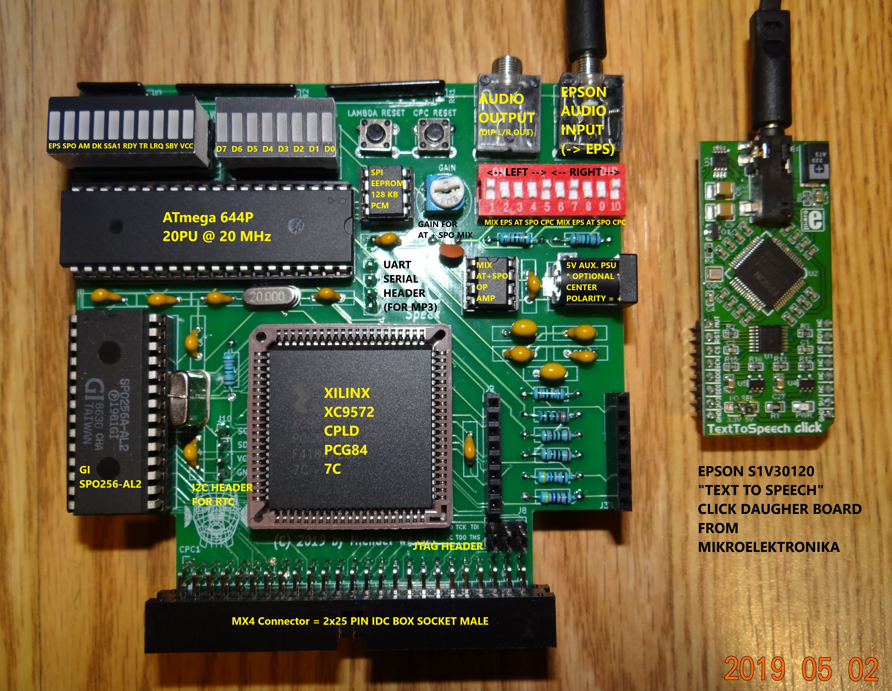

LambdaSpeak 3 processes 3 or 4 sources of audio. The 10 position DIP switch is used to assign these different sources to either the left or right audio channels of LambdaSpeak's stereo output jack. A source can also be assigned to both left and right. The DIP switches 1 to 4 determine which audio source is routed to the left, and the switches 6 to 9 are used to assign the right audio channel of the stereo output jack.  Moreover, the non-plus CPCs also allows to loop back the audio signal into the CPC using the SND pin of the expansion port. The loopback audio signal then gets amplified and gets routed to the CPC’s internal speaker. This does not work for Plus CPCs though. Hence, switches 5 and 10 can be used to switch the loopback on or off. Regardless of the switches 5 and 10, an external amplifier can always be connected to LambdaSpeak's stereo output jack. 

The audio sources processed and routed via the DIP switch are the following. The corresponding labels are printed on the PCB; see picture. **Please note that there should be at most one audio signal routed to the left output channel, and at most one audio signal routed to the right output channel. It is OK to route one source to both left and right, but one should not route two sources (or more) to the same (left or right) channel!**

From left to right, the DIP switches 1 to 5 and 6 to 10 are: 

  - **MIX (1 = left, 6 = right):** MIX is the output of LambdaSpeak's OP amp. The OP amp is a summing OP amp with Gain control that amplifies and recovers the mono PCM output generated by the ATmega (PCM Sample Playing), and the sound generated by the SP0256-AL2 vintage speech chip. The corresponding DIP switch determines if the OP amp's output is routed to the left and/or right output channel (or turned off completely). Notice that using an OP amp always results in some degradation of the audio quality. Hence, it is also possible to exclusively route the PCM output or exclusively route the SP0256-AL2 output to the left or right channel (see switches SP0 and AT below). If no SP0256-AL2 is being used, then there is no need for the MIX output, and the switch should be in the off position. 

  - **EPS (2 = left, 7 = right):** Turn on or off routing of the stereo audio signal received over LambdaSpeak's stereo audio input jack (the right stero jack on the board). Usually, this connects to the output output jack of the Epson click daughter board. The output of the Epson speech board is mono, but heard on the left and right channel. The TTS click daughterboard is already equipped with an audio amplifier, so it also possible to directly connect a loudspeaker or audio amplifier to the audio socket of the daughterboard itself. In the case, LambdaSpeak's stereo input jack is available to receive either the audio output generated by the  CPC, using the audio stereo output jack of the CPC (and left or right channels will be routed accordingly), or to the output of the MP3 module can be used (see below). In any way, the left or right channels will be routed accordingly (i.e., left to left and right to right). Note that EPS input is not amplified by the internal OP amp. 

  - **AT (3 = left, 8 = right):** the raw PCM output from the ATmega; used for the Amdrum mode and the autonomous PCM Sample Playing mode. This signal has higher quality than the MIX output. If no SP0256-AL2 is being used, then there is no need for the MIX output, and the AT raw PCM output achieves higher PCM quality and bandwidth. 

  - **SP0 (4 = left, 9 = right):** the raw speech output from the optional SP0256-AL2 chip; used for the SP0-based SSA1 and DK’tronics modes. This signal has higher quality than the MIX output. If no SP0256-AL2 is being used, then this switch should be in the off position. 

  - **CPC (5 = left, 10 = right):** determines if the left (resp. right) output channel of LambdaSpeak's stereo output jack should be routed into the CPC's internal audio amplifier and speaker. Please note that the assignment of the left and right output of LambdaSpeak's stereo jack is determined by the DIP switches 1 to 5, and 6 to 9, resp., as just explained. This does not work on the Plus line of CPC computers, so these switches should be in the off position for a CPC Plus computer. 
 
A *reasonable default configuration* for a LambdaSpeak 3 *with SP0256-AL2* is `10001-01001`. Hence, MIX on the left output channel, and Epson speech on the right output channel. Moreover, both are being heard in the CPC's internal speaker as well, so no need for an external amplifier. 

A *reasonable default configuration* for a LambdaSpeak 3 *without SP0256-AL2* is `00101-01001`, resulting in raw ATmega PCM audio on the left channel, and Epson speech on the right. Moreover, the CPC speaker is turned on. 

A *reasonable default configuration* for an Amdrum / PCM Sample Playing session could be `00101-00101`, giving raw ATmega PCM audio on the left and right channel, and no speech output at all. However, an extra cable and external mixer and amplifier or dedicated loudspeaker could still be used for Epson speech (use the daughterboard’s own stero jack). 

The **10 LED segment bar on the left** is used to indicate the current mode / status of LambdaSpeak 3. The LEDs have the following meaning:

  - **VCC:** Power LED. 
  - **SBY:** If fitted with a SP0256-AL2, the status of the SBY pin ("Standby"). 
  - **LRQ:** If fitted with a SP0256-AL2, the status of the LRQ pin ("Load Request"). 
  - **RDY**: Mostly used to indicate that LambdaSpeak is ready to accept input; however, the LED is also used for other purposes.
  - **TR**: Mostly used to indicate that LambdaSpeak is transmitting data to the Epson daughterboard (that it is speaking); however, the LED is also used for other purposes.  
  
  - the LEDs **EPS, SP0, AM, DK, SSA1** are used to indicate the current mode. 

    ------------------------------------------------------------------------------------------------------------
    | EPS | SP0 | AM  | DK  | SSA1 | Mode                | To Enter  | To Quit     |   Notes & Comments        |
    |-----|-----|-----|---- |------|---------------------|-----------|-------------|----------------------------
    |  x  |  x  |     |  x  |   x  | NO-OP Data to LEDs  |    &F0    | Send byte   | Show byte on LED Outputs  | 
    |     |     |     |     |      | Serial Mode / UART  |    &F1    | &FF, &14    | For MP3, RS232, FTDI      | 
    |  X  |     |     |  X  |   X  | Epson               |    &EF    | CM          | Natural Speech            |
    |  X  |     |     |     |      | DECtalk             |    &EE    | CM          | DECtalk can even sing     | 
    |  X  |     |     |     |   X  | SSA1 Emulation      |    &ED    | CM          | **LS Default Mode**       | 
    |  X  |     |     |  X  |      | DK’tronics Emulation|    &EC    | CM          | Better than SP0           | 
    |     |  X  |     |     |   X  | SSA1 SP0            |    &E2    | CM          | SSA1 Re-Implementation    |
    |     |  X  |     |  X  |      | DK’tronics SP0      |    &E1    | CM          | DKtr. Re-Implementation   | 
    |     |     |  X  |     |      | Amdrum Emulation    |    &E3    | PC          | Amdrum PCM Emulation      |
    |     |     |  X  |  X  |   X  | EEPROM PCM Upload   |    &FE    | EOM RB      | Send PCM Data to EEPROM   |
    |     |  X  |  X  |  X  |   X  | EEPROM PCM Play     | &FA - &FD | Channel &FF | 1 to 4 Channel HQ PCM     | 
    |     |     |  X  |  X  |   X  | EEPROM Data Upload  |    &F9    | EOM RB      | Send data to EEPROM       |
    |     |  X  |  X  |  X  |   X  | EEPROM Get Data     |    &F7    | EOM RB      | Return when data received | 
    ------------------------------------------------------------------------------------------------------------

    These different modes are going to be explained in more detail in the subsequent sections. 
    `PC` = Power Cycle, `RB` = Reset Button, `EOM` = `End of mode`, `CM` = `Change Mode` (means that the control bytes `To Enter` a different mode will be accepted in that mode), `&FF, &14` = sequence of command / control bytes in hexadecimal (first send 255 = &FF, then 20 = &14). `HQ PCM` = High Quality PCM (Pulse Code Modulation), > 18 khZ possible, 8 Bit PCM. 

The **8 LED segment bar on the right** is used to indicate the current / last byte transmitted from the CPC to LambdaSpeak (the last databus byte latched from IO port &FBEE). A `out &fbee,byte` BASIC command will show the `byte` in binary on the LED segment. Moreover, by removing the LED segment bar from its socket, the socket can be used as General Purpose Digital Output controlled by the CPC; for example, an 8-Relay Module can be driven by these outputs to control home appliances or other devices from the CPC. It is not possible to do General Purpose Digital Input over these ports, but the CPC's joystick port could be used for that purpose. 

#### Overview of LambdaSpeak 3 Modes 

The following automaton gives an overview of the different modes and transitions between modes: 

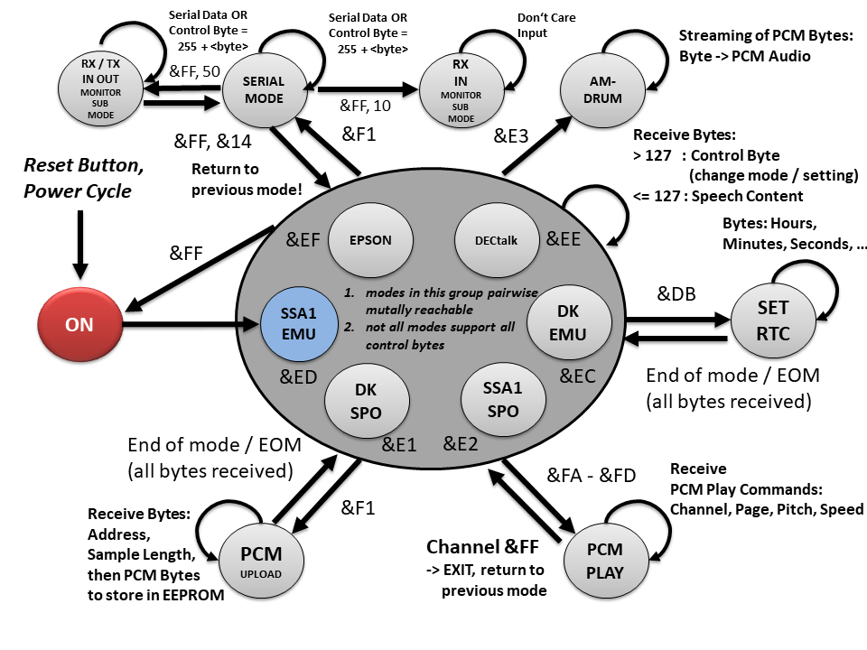 

There is also [a PDF version of this image.](manuals/ls3-modes.pdf). 

The default mode is the SSA-1 Emulation mode. This mode is enabled after a reset (via `&FF` or reset button), or after a power cycle, for example. 

Referring to the table above, the EEPROM PCM Play mode is the autonomous PCM sample playback mode; sample / WAV files are being played back from EEPROM.  Since this mode can also involve the SP0256-AL2 (addressed via Channel 8), the SP0 LED is being lit as well in this mode. Moreover, to upload the PCM samples from the CPC into LambdaSpeak's EEPROM, the EEPROM PCM Upload mode is being used. 

The **EEPROM Data Upload** mode is identical to the EEPROM PCM Upload mode, with the difference that the PCM Samples are not being played after upload (for PCM testing), as the data is not necessarily PCM data. The data from the EEPROM can also be retrieved, using the **EEPROM Get Data** mode; note that 2 EEPROM Data Upload and EEPROM Get Data is not shown in the automaton diagram. 

LambdaSpeak 3 is controlled by sending "control bytes" or "commands" - the different modes are enable and disabled by sending control bytes. In normal operation mode (i.e., the standard dispatcher loop is running), each byte being sent to IO port `&FBEE` > 127 is considered a control byte. All bytes smaller 128 are considered as content (phonemes, text, ...) for the speech synthesizer. This is the behavior of LambdaSpeak's normal control byte dispatcher / main mode listener loop.

In every mode, it can be determined if LambdaSpeak 3 is ready to accept the next command or data byte, by reading a status byte from `&FBEE`. Mainly, there are **indicator bytes for READY and BUSY**; unfortunately, **different modes are using different READY and BUSY indicator bytes.** For example, the Amstrad SSA-1 mode is using 128, and the native modes of LambdaSpeak (DECtalk and EPSON mode) are using 32. The 0 is used for BUSY. See below for details. 

In case data is communicated over the databus to the CPC (e.g., for commands that return the current voice, volume, data received over the serialinterface, or data from the EEPROM), the READY / BUSY indicator bytes are used partially in order to not interfere with the data being transmitted to the CPC. 

The **Serial Mode / UART** has its own command dispatcher / listener loop, and follows different conventions. See below for an explanation of the Serial Mode. 

The Amdrum Emulation mode does support any control / command bytes,
and each byte is considered a PCM sample.

In addition, there are some "sub" modes for setting the RTC (Real Time Clock) time and calendar. These modes do not have a dedicated LED pattern. Normal operation is resumed after the clock (resp. calendar) has been set (it returns to the previously active mode). To set the time, invoke control byte / command `&DB`, and then send the hours, minutes, and seconds to the databus (port `&FBEE`), one byte at a time. Likewise, to set the calendar, invoke control byte `&DA`, and then send the year, month, date, and weekday (1 to 7 for Monday to Sunday) on the databus, one byte at a time. The set time and set calendar sub modes are 'modal' in the sense that normal operation of LambdaSpeak 3 is suspended until all requested parameters have been received. While the set time and set date commands are still requesting parameters, normal control byte dispatching is disabled, and LambdaSpeak returns to its previous mode (hence exiting the modal "sub" mode) after the clock (resp. calendar) has been set. There is no special LED pattern to indicate these set time and set calendar "sub" modes.

Another sub mode is the *echo test program* which runs an echo program of `&FBEE` until reset button or power cycle (see below).

Note that, in the table above, `PC` stands for Power Cycle - the only way of quitting the Amdrum mode is to power cycle the CPC (and LambdaSpeak). This is of course always an option to quit any of the listed modes, but the Amdrum mode it is the only way of quitting it. `EOO` stands for `end of operation`; this means that normal control byte / command dispatching is resumed after all requested bytes have been received, so the mode terminates / quits itself and returns to LS 3 default mode.  `RB` stands for the LambdaSpeak Reset Button -- with the exception of the Amdrum mode, the Reset Button is of course always an option to leave the current mode, but it is listed for a mode in the table above if there is no other way of quitting this mode.
    

#### Schematics 

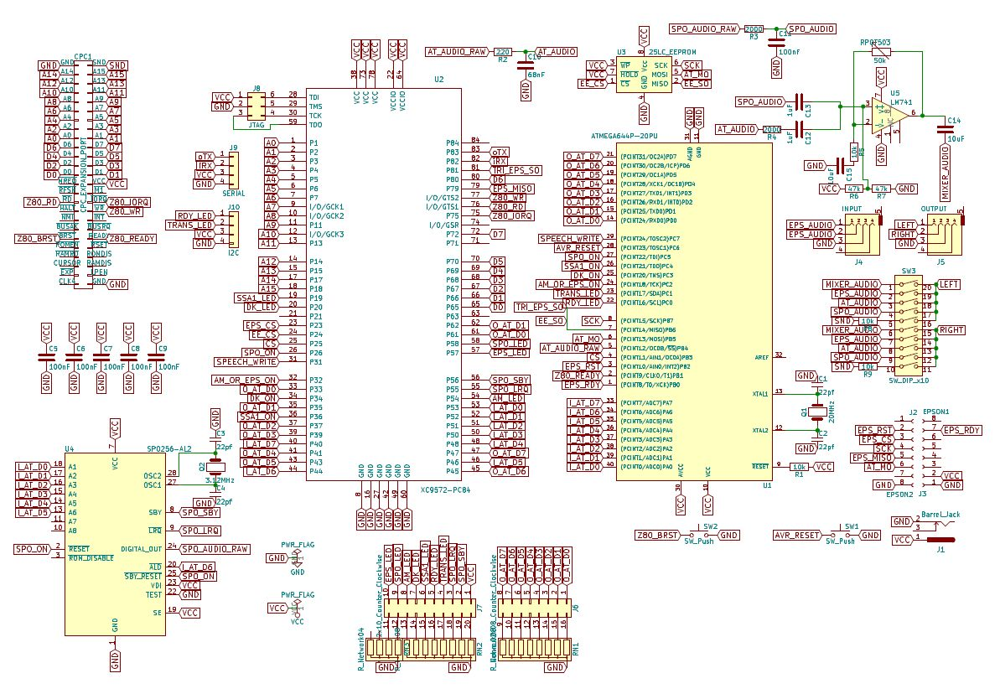 
[Click here for a PDF version of the schematics.](schematics/schematics.pdf) 

#### Printed Circuit Boards 

LambdaSpeak 3 was made with [KiCad EDA v4.0.7](http://kicad-pcb.org/),
and "freeRouting.jar" did the routing.

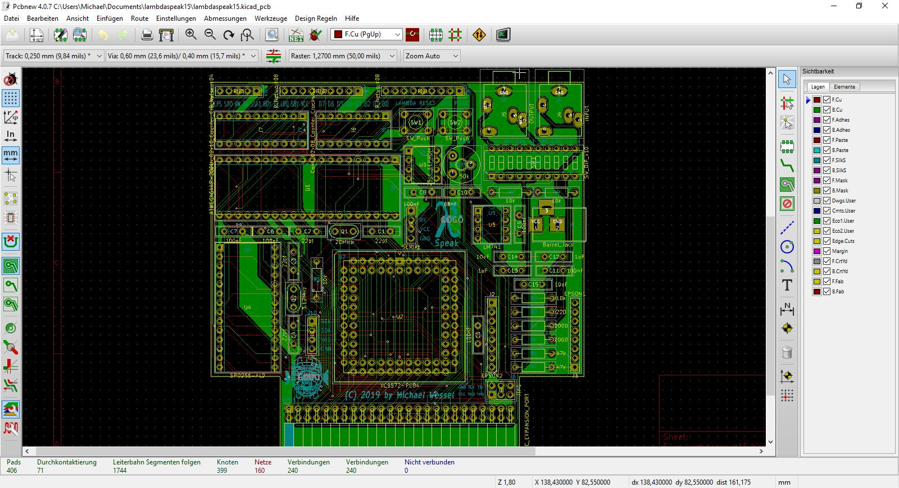 
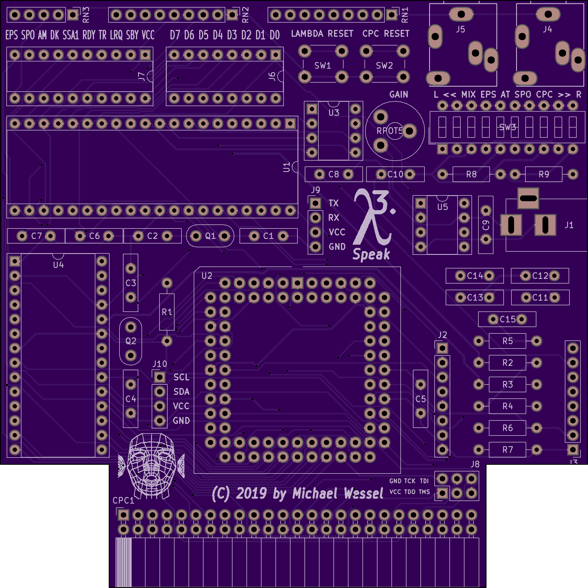 
 
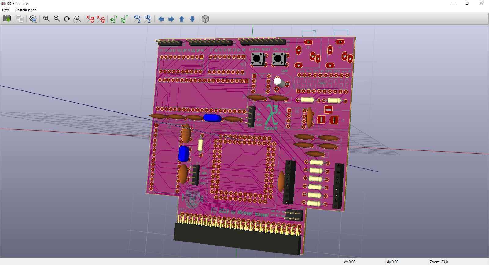

[Gerbers can be found here.](gerbers/lambdaspeak30-final.zip) 

A version is also hosted on the [Seeed Gallery for immediate ordering of PCBs.](https://www.seeedstudio.com/LambdaSpeak-3-g-1230571)

### Bill of Material 

Please note that the resistor networks (`RN1`, `RN2`, `RN3`) are all 1k Ohm. All other values can be found in the BOM: 

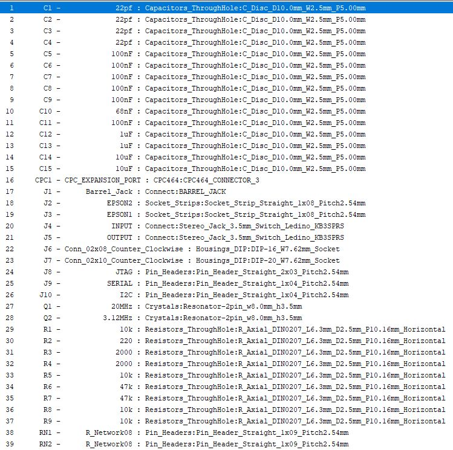 

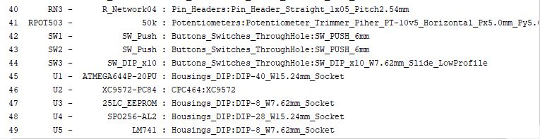 

I recommend the use of standard stackable Arduino Headers for J1 and J2 (instead of soldering the daughter board in permanently). A standard 2x25 angled IDC Box Header can then be used to plug LambdaSpeak into the **Mother X4 board** or [**LambdaBoard**](https://www.seeedstudio.com/LambdaBoard-Expansion-Board-Backplane-for-Amstrad-CPC-Computers-g-1143632). Else, usa a 50 pin ribbon cable. For the CPC 464 and 664, there is also [my CPC 464 expansion port connector](https://oshpark.com/shared_projects/3yA33GYO) as an option.

The form factors in the above BOM are **for illustration only.** Instead of ceramic disc capacitors, I have used ceramic multilayer capacitors mostly. I recommend using DIP sockets for all chips. 

### Media 

#### Some Pictures

Final breadboard prototype: 

First PCB with RTC and MP3 modules added when LambdaSpeak 3.0 was already "final", and "Zhulien" from the CPC Wiki Forum had suggested adding the UART MP3 module; and then I couldn't stand to leave the last 3 KBs of ATmega program memory unused, and added the I2C RTC – of course, this required on more PCB revision after this prototype worked: 

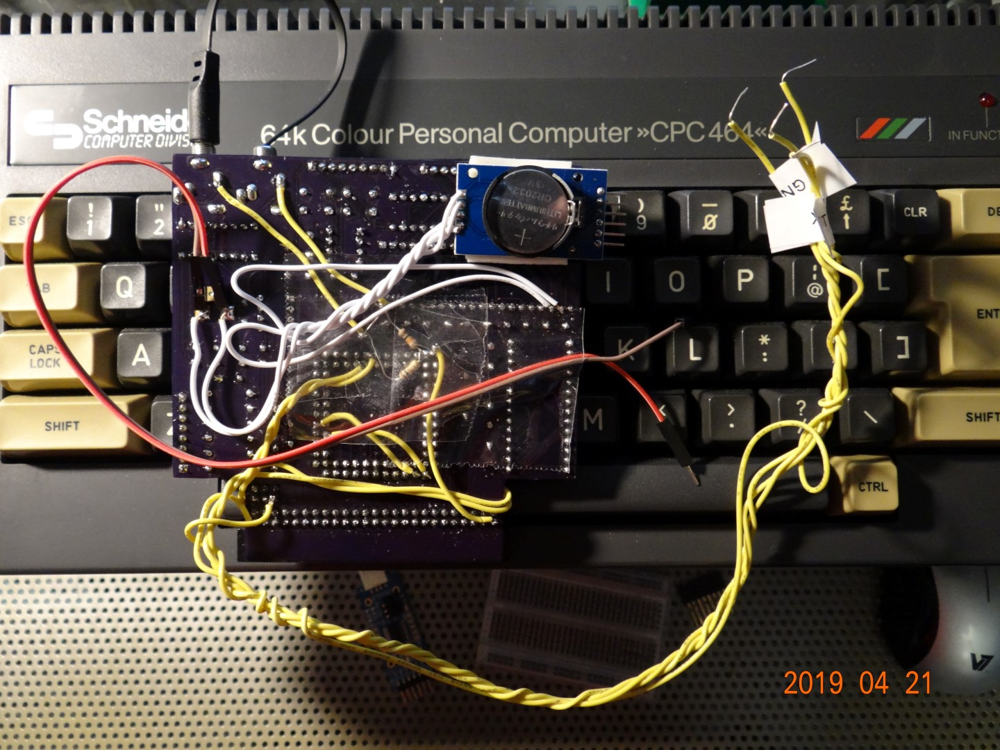

Final version of LambdaSpeak 3: 

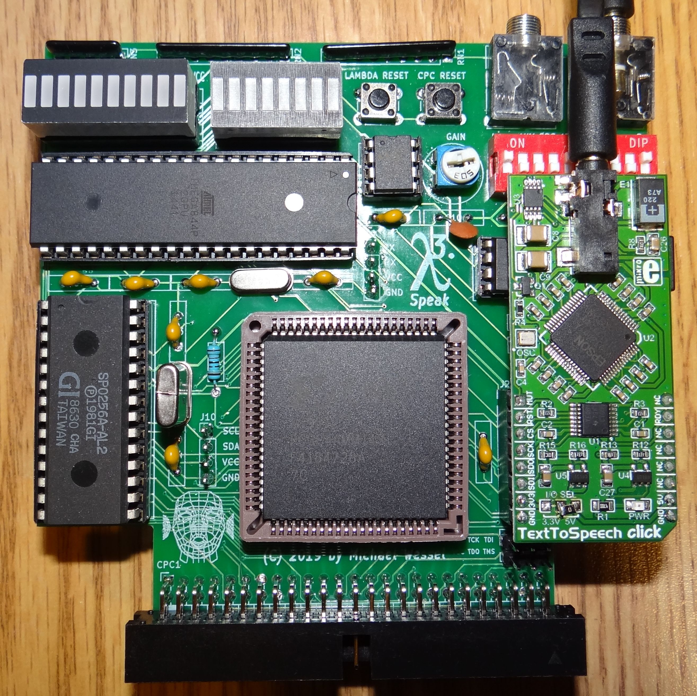

Backside of LamdbaSpeak 3, with Catalex MP3 UART module connected / soldered in, and I2C DSS3231 RTC with buffer battery connected to I2C header: 

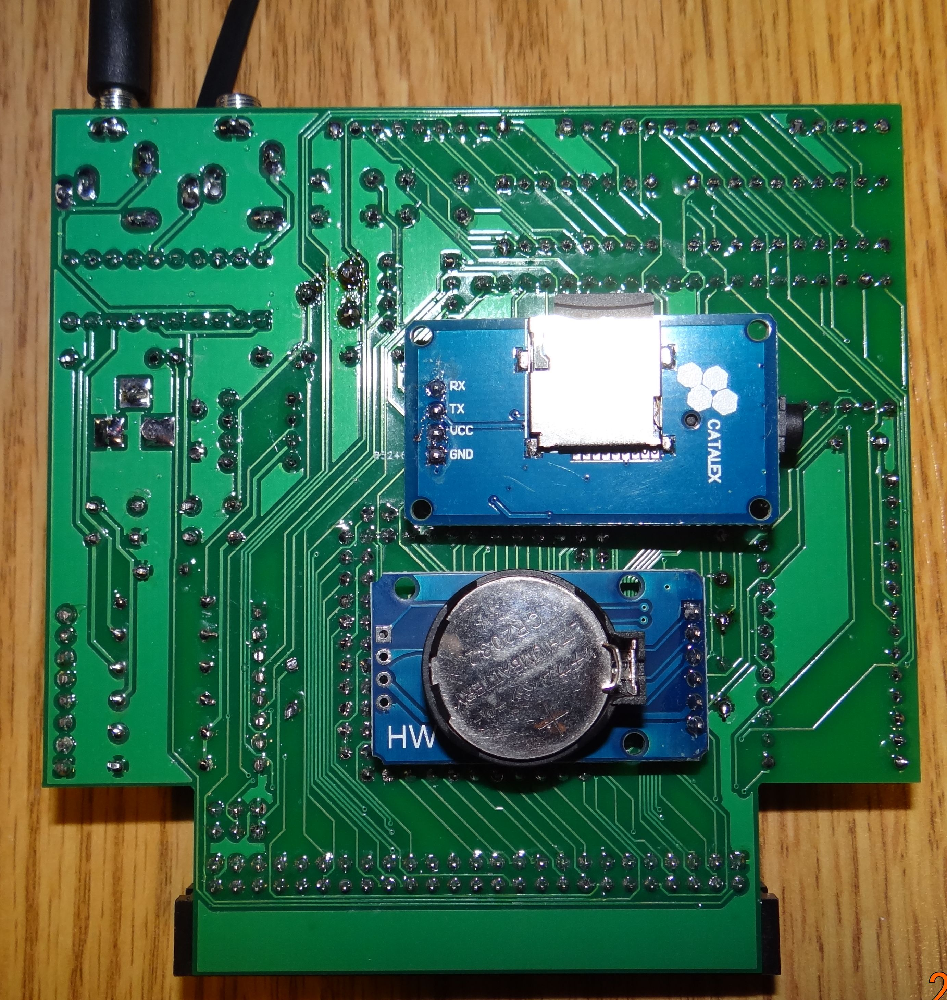

LambdaSpeak 3 plugged into my **LambdaBoard** CPC expansion backplane: 

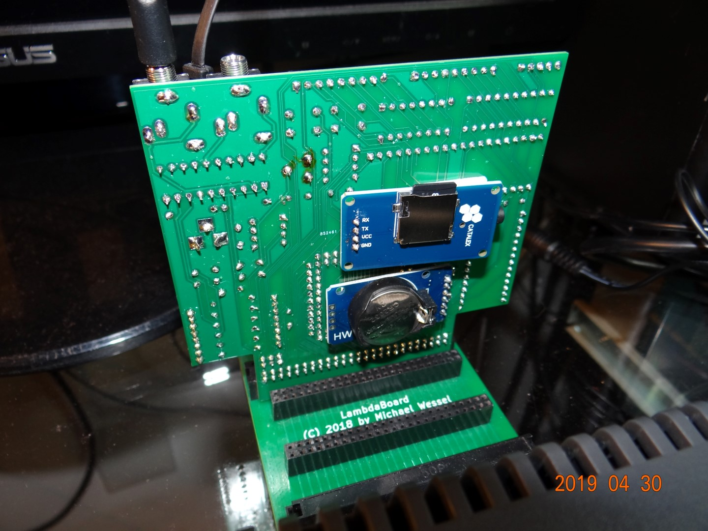

#### Some YouTube Videos of LambdaSpeak 3 in Action

- [Amdrum Emulation Testing with early Breadboard Prototype](https://youtu.be/VLRJbIvIBPY?list=PLvdXKcHrGqhclo29whlfaO76ge2d-chmx)
- [SP0256-AL2 Testing](https://youtu.be/09xEWBEMHK0?list=PLvdXKcHrGqhclo29whlfaO76ge2d-chmx) 
- [Driving Relays / Home Automation with the CPC?](https://youtu.be/FM8kbuwGmSI?list=PLvdXKcHrGqhclo29whlfaO76ge2d-chmx)
- [LambdaDrum Early PCM Test](https://youtu.be/BKLnTiDfbk8?list=PLvdXKcHrGqhclo29whlfaO76ge2d-chmx)
- [LambdaDrum PCM Test](https://youtu.be/9VoMoj8Qr0s?list=PLvdXKcHrGqhclo29whlfaO76ge2d-chmx)
- [LambdaDrum with Boss DR660 Samples](https://youtu.be/k0D6YG4FTk4?list=PLvdXKcHrGqhclo29whlfaO76ge2d-chmx)
- [LambdaDrum BASIC Drumming](https://youtu.be/CklrKWw14GU?list=PLvdXKcHrGqhclo29whlfaO76ge2d-chmx)
- [LambdaDrum BASIC Sequencer with HighDef Samples](https://youtu.be/BGyaB4OQniw?list=PLvdXKcHrGqhclo29whlfaO76ge2d-chmx)
- [LambdaDrum BASIC Sequencer with MediumDef Samples](https://youtu.be/M7aI7KLEi1s?list=PLvdXKcHrGqhclo29whlfaO76ge2d-chmx)
- [Talking Battery-Buffered Real Time Clock](https://youtu.be/Dsok873zTjM?list=PLvdXKcHrGqhclo29whlfaO76ge2d-chmx)
- [UART MP3 Player](https://youtu.be/NtUVlTJrOkU?list=PLvdXKcHrGqhclo29whlfaO76ge2d-chmx) 
- [RS232 Serial Interface Test](https://youtu.be/uKeZEkyIqtg?list=PLvdXKcHrGqhclo29whlfaO76ge2d-chmx)
- [FTDI USB Cable Serial Interface Test](https://youtu.be/8MZMzynYyxI?list=PLvdXKcHrGqhclo29whlfaO76ge2d-chmx)

#### Older Versions

Check of [the predecessors of LambdaSpeak 3.](https://github.com/lambdamikel/LambdaSpeak) 

### The Modes of LambdaSpeak 3 and the LambdaSpeak Firmware 

When LambdaSpeak 3 is turned on, or after a reset command (`&FF`), or after the reset button has been pressed, it starts in the SSA1 Emulation mode (`&FD`). This mode was selected such that games that support the Amstrad SSA-1 speech synthesizer work out of the box without requiring further configuration of LambdaSpeak 3 (e.g., "Roland in Space"). However, this mode does not produce the best speech or most natural sounding speech. The Epson and DECtalk modes are far superior in speech quality. 

**Please note that the latest version of the LambdaSpeak 3 firmware no longer produces the initial "LambdaSpeak initialized. SSA-1 mode." spoken boot message. So LS3 will just remain silent if turned on or being reset. You can always check for correct operation and the current mode by using `out &fbee,&c3`. The startup message was removed because certain applications such as MP3 music playing require distraction- and confirmationless "silent" mode changes. For a completely silent operation with no spoken confirmations at all, turn off all confirmations immediately after a power cycle or reset using `out &fbee, &e8`.**

As mentioned previously, with the exception of the SP0-based SSA1 and DK’tronics modes, all speech content is 7bit, hence bytes < 128 are being buffered in a speech input buffer, and if within x milliseconds (a configurable flush delay time) no new content has been received, the buffer is spoken. Hence, speech is asynchronous, and a slight delay is to be expected. Also, the speech input buffer has a limited size of 253 bytes, hence the buffer is also flushed and hence spoken if that limit is reached. 

Moreover, every byte with 8th bit set, hence bytes > 127, are consider command bytes or control bytes. The bytes are used for setting various parameters (voice, volume, speak rate), and for changing modes of LambdaSpeak 3. The table of command / control bytes is given below. 

Unlike the Epson-based speech modes (SSA1 Emu, DK’tronics Emu, Epson mode, DECtalk mode), the SP0-based speech modes are not using buffered input, and speech is synchronous. Every byte < 128 is directly  sent and processed by the SP0256-AL2 speech chip. Also, most settings such as voice, volume, language etc. only apply to the Epson-based speech synthesizer, not the SP0256-AL2. 

This tables shows the command / control bytes recognized by LambdaSpeak: 

-------------------------------------------------------------------------------------------------------------------------
| M/CB | Explanation                | Note                          | Epson, DECtalk, SSA1 & DK Emu | SSA1 SP0 & DK SP0 | 
|------|--------------------------- |-------------------------------|-------------------------------|-------------------|
| &FF  | Reset LambdaSpeak          | Restarts firmware, SSA1 emu   |                X              |         X         |
| &FE  | EEPROM PCM Upload          | Send page, #bytes, then bytes |                X              |         X         | 
| &FD  | Enable PCM 4 Channel Play  | Use "Play PCM" command        |                X              |         X         |
| &FC  | Enable PCM 3 Channel Play  | Use "Play PCM" command        |                X              |         X         | 
| &FB  | Enable PCM 2 Channel Play  | Use "Play PCM" command        |                X              |         X         |
| &FA  | Enable PCM 1 Channel Play  | Use "Play PCM" command        |                X              |         X         |
| &F9  | EEPROM Data Upload         | Same as &FE, no PCM test play |                X              |         X         |
| &F8  | EEPROM Erase               | Clears all EEPROM data        |                X              |         X         |
| &F7  | EEPROM Data Download       | Send start page and no. pages |                X              |         X         |
| &F5  | EEPROM Erase & Check       | Checks for errors & clears    |                X              |         X         | 
| &F4  | Non Blocking Confirmations | Z80 not halted during confirm.|                X              |         X         |
| &F3  | Blocking Confirmations     | Z80 halted for confirmations  |                X              |         X         |
| &F2  | Get Mode Descriptor Byte   | Return numeric code for mode  |                X              |         X         | 
| &F1  | Enable Serial Mode         | Use UART commands             |                X              |         X         |
| &F0  | Send next byte to LEDs     | To show byte on LEDs / output |                X              |         X         |
| &EF  | Enable Epson Mode          | Natural sounding speech       |                X              |         X         | 
| &EE  | Enable DECtalk Mode        | DECtalk is most advanced      |                X              |         X         |
| &ED  | Enable SSA1 Emu Mode       | DECtalk-based SSA1 emulation  |                X              |         X         |
| &EC  | Enable DK’tronics Emu Mode | DECtalk-based DKtronics emul. |                X              |         X         |
| &EB  | Non Blocking Speech Mode   | Z80 not halted for speech     |                X              |                   | 
| &EA  | Blocking Speech Mode       | Z80 halted for speech         |                X              |                   |
| &E9  | Command Confirmation On    | Speak confirmations           |                X              |                   |
| &E8  | Command Confirmations Off  | Don't speak confirmations     |                X              |                   |
| &E7  | English Mode On            | English Mode Epson / DECtalk  |                X              |                   | 
| &E6  | Castilian Spanish Mode On  | Spanish Mode Epson / DECtalk  |                X              |                   | 
| &E5  | Short Delay for Getters    | Value on databus for 10 us    |                X              |                   | 
| &E4  | Long Delay for Getters     | Value on databus for 20 ms (BASIC) |                X              |                   | 
| &E3  | Enable Amdrum Emu Mode     | Enable Amdrum, `out &FFxx,n`  |                X              |         X         | 
| &E2  | Enable SSA1 SP0 Mode       | Authentic SP0 SSA1 mode       |                X              |         X         |
| &E1  | Enable DK’tronics SP0 Mode | Authentic SP0 DK’tronics mode |                X              |         X         | 
| &E0  | Medium Delay for Getters   | Value on databus for 50 us    |                X              |         X         | 
| &DF  | ASYNCHRONOUS STOP SPEECH   | Stop speech immediately       |                X              |                   | 
| &DE  | Flush Speech Buffer Now    | Flush buffered speech content |                X              |                   |  
| &DD  | Speak RTC Time             | Speak current time (RTC req.) |                X              |                   |
| &DC  | Speak RTC Date             | Speak current date (RTC req.) |                X              |                   |
| &DB  | Set RTC Time               | Send hours, minutes, seconds  |                X              |                   | 
| &DA  | Set RTC Calendar           | Send day, date, month, year   |                X              |                   | 
| &D9  | Get RTC Weekday            | 1 = Monday, 7 = Sunday        |     Epson & DECtalk only      |                   |
| &D8  | Get RTC Date               | Read 1 to 31 from `&FBEE`     |     Epson & DECtalk only      |                   |
| &D7  | Get RTC Month              | Read 1 to 12 from `&FBEE`     |     Epson & DECtalk only      |                   |
| &D6  | Get RTC Year (20xx)        | Read 00 to 99 from `&FBEE`    |     Epson & DECtalk only      |                   |
| &D5  | Get RTC Seconds            | Read 0 to 59 from `&FBEE`     |     Epson & DECtalk only      |                   |
| &D4  | Get RTC Minutes            | Read 0 to 59 from `&FBEE`     |     Epson & DECtalk only      |                   |
| &D3  | Get RTC Hours              | Read 0 to 23 from `&FBEE`     |     Epson & DECtalk only      |                   |
| &D2  | Get RTC Temperature (C)    | Read 0 to ?? (C) from `&FBEE` |     Epson & DECtalk only      |                   |
| &D1  | Speak RTC Temperature (C)  | Speak temperature degrees C.  |                X              |                   |
| &CF  | Get Mode (LS1.95 Compat.)  | Read (Old) Mode from `&FBEE`  |                X              |                   |
| &CE  | Get Volume                 | Read Volume from `&FBEE`      |                X              |                   | 
| &CD  | Get Voice                  | Read Voice from `&FBEE`       |                X              |                   |
| &CC  | Get Speak Rate             | Read Speak Rate from `&FBEE`  |                X              |                   |
| &CB  | Get Language               | Read Language from `&FBEE`    |                X              |                   |
| &CA  | Get Buffer AutoFlush Delay | Read Flush Delay from `&FBEE` |                X              |                   |
| &C9  | Get Firmware Version       | Read Version No. from `&FBEE` |                X              |                   | 
| &C8  | Speak Copyright/Info Note  | Some Info about LambdaSpeak 3 |                X              |         X         |
| &C7  | Speak HAL9000 Quote        | HAL9000 inside LambdaSpeak 3! |                X              |         X         |
| &C6  | Sing DECtalk "Daisy" Song  | A classic DECtalk song        |                X              |         X         |
| &C5  | Run Port Echo Test Program | Test `&FBEE` IO communication |                X              |         X         | 
| &C3  | Speak Current Mode Info    | Announce current mode         |                X              |         X         |
| &C2  | Run PCM Test Program       | A PCM test sample loop; reset.|                X              |         X         | 
| &Bx  | Use Voice x                | There are 8 predefined voices |                X              |                   | 
| &B0  | Use Default Voice          | `Perfect Paul` is default   e |                X              |                   | 
| &Ax  | Set Volume to x            | There are 14 levels           |                X              |                   | 
| &A0  | Use Default Volume         | Default volume is 13          |                X              |                   | 
| &9x  | Set Speak Rate to x        | Rate = 15 + 25*x words / sec  |                X              |                   | 
| &90  | Use Default Speak Rate     | Default rate for x = 9        |                X              |                   | 
| &8x  | Set Fush Buffer Delay x    | Delay = 10 + x * 10 ms        |                X              |                   | 
| &80  | Use Default Flush Delay    | Default delay is x=10 (110 ms)|                X              |                   | 
-------------------------------------------------------------------------------------------------------------------------

#### Epson Mode

Same high speech quality as DECtalk mode; natural sounding English and Spanish speaking. Easy to program.  Check out the `ENGLISH.BAS` and
`SPANISH.BAS` example programs on [the
`LS300.DSK`](cpc/lambda/LS300.dsk) to learn about the syntax of the
Epson mode, and the [documentation of the Epson mode in ([the manual; see section on Epson Parser.](https://www.parallax.com/sites/default/files/downloads/30016-Emic-2-Text-To-Speech-Documentation-v1.2.pdf))

#### DECtalk Mode

Very versatile and powerful speech synthesis - can even sing!  Check out the `WELCOME.BAS` and `DECSING.BAS` example programs on [the
`LS300.DSK`](cpc/lambda/LS300.dsk) to learn about the syntax of the
Epson mode, and the [documentation of the DECtalk
mode](manuals/EpsonDECtalk501.pdf). 

There is also a [repository of DECtalk songs](http://www.theflameofhope.co/SONGS.html). 
However, most of these songs were written for an earlier version of DECtalk v2 (and LambdaSpeak uses DECtalk v5). Hence, they require conversion. You can get an idea by running `DECSING.BAS` and by either loading `BANNER` or `BDAY`. Also, there is a built-in song in LambdaSpeak 3, which you can listen to via control byte `&C6`. 

#### DECtalk-based SSA1 Mode (SSA1 Emulation)

This is the DECtalk-based emulation of the classic Amstrad SSA1 speech synthesizer. This emulation is faithful enough such that the SSA1 driver software, and classic games such as `Roland in Space` will work in this mode. The speech sounds different from the original though, since DECtalk is being used, and not the SP0256-AL2. Use the SP0-based SSA1 mode for full authenticity and 100% faithful SSA1 speech. 

#### DECtalk-based DK'tronics Mode (DK’tronics Emulation) 

This is the DECtalk-based emulation of the classic DK’tronics speech synthesizer. The emulation is faithful enough such that the DK’tronics RSX driver software, and classic games such as `Roland in Space` will work in this mode. The speech sounds different from the original though, since DECtalk is being used, and not the SP0256-AL2. Use the SP0-based DK’tronics mode for full authenticity and 100% faithful DK’tronics speech. 

#### Authentic SP0256-AL2-based SSA1 Mode (SSA1 Re-Implementation)

This is a fully authentic re-implementation of the original classical Amstrad SSA1 speech synthesizer. 

#### Authentic SP0256-AL2-based DK’tronics Mode (DK’tronics Re-Implementation)

This is a fully authentic re-implementation of the original classical DK’tronics speech synthesizer. 

#### Amdrum Mode (Amdrum Emulation) 

LambdaSpeak 3 offers a PCM sample-playing mode - it emulates the **Amdrum module**. In this mode, every byte sent to port `&FFxx` (xx = arbitrary) will immediately be played as an 8bit PCM sample. The **Amdrum software** works out of the box in this mode, and sample quality is surprisingly good / high, considering that no DAC chip is being used; rather, the PCM conversion is implemented in software using a fast ATmega timer, and a simple RC filter is utilized. This mode can only be quit by power cycling LambdaSpeak. All ATmega interrupts are disabled, for maximum processing speed and sample quality (hence, even the reset button of LambdaSpeak is ineffective). Decoding of IO addresses &FFxx will only be active when the Amdrum mode is enabled. 

Note that this mode is different from the autonomous PCM Playing mode, which uses the onboard SPI 128 KB EEPROM for storing PCM samples. The sound quality of the EEPROM PCM Playing mode is superior to the
Amdrum mode and comes with zero CPU load, unlike the Amdrum mode. 

However, the Amdrum mode allows you to use the awesome Amdrum software, and other CPC software that "streams" the PCM sample bytes over the databus. 

#### EEPROM PCM Upload Mode 

The 128 KB SPI EEPROM, which is used to store the PCM wave files / samples for the autonomous PCM Play Mode (not the Amdrum mode), is organized in **pages.** Whereas the SPI EEPROM has 512 pages of 256 bytes, in order to keep page addressing to one byte, **LambdaSpeak uses pages of 512 bytes.** The first page number is 0, the last one 255. However, page number 0 cannot be accessed for EEPROM-based PCM sample playing, since the 0 byte is used as a byte separator / clock signal in that mode, see below. However, page 0 can be used for storing arbitrary data (see below). Each page can hold one PCM WAV "file", but a PCM WAV sample (file) can also span multiple pages, or even oocupy the whole 128 KBs of the EEPROM. 

Pages are uploaded as a whole. In case a sample does not fill a whole
page, the remaining bytes need to be filled with 127. 

Uploading a sample / wave file into the EEPROM is simple: 
 
1. Enter the PCM EEPROM Upload Mode by sending `&FE`.  
2. Send the start page number, from 1 to 255 (using `out &fbee,startpage`). 
3. Send the number of pages  (using `out &fbee,no-pages`). 
4. Send no-page * 512 bytes to (using `out &fbee,byte`). 
Note that 127 is used to fill the remaining bytes in the page until it is full.  
5. After all bytes have been received, LambdaSpeak 3 returns to normal  operation (i.e., its previous mode). 

Notice that the speech synthesizer will also speak instructions what kind of input is expected during the upload process (i.e., it will say 
"Send page number" for step 2., etc.) However, confirmations must be enabled for these spoken instructions. 

A couple of BASIC programs illustrate how to upload PCM samples into the EEPROM; check the `DRUMLOAD.BAS` program on the
[`MIDEFSEQ2.DSK`](cpc/lambda/midefseq2.dsk) disk. This uploads a drum
set from the Boss DR660 drum computer in medium PCM sample quality (16
kHz) into the EEPROM. Since this is a BASIC program, loading the whole drum set takes about 15 minutes. A machine code program should be able to upload this within seconds. 

**Note that on the same [`MIDEFSEQ2.DSK`](cpc/lambda/midefseq2.dsk) disk, there is also a program `DRUMLD2.BAS` that uses the `|PCMUP` RSX command from TFM's LambdaSpeak 3 RSX Extension / ROM (see below). Using |PCMUP, the same WAV samples can be uploaded within seconds.** 

#### EEPROM Arbitrary Data Upload Mode 

Identical to the PCM Upload Mode (see above), BUT does not invoke the PCM sample testing. 
The only other difference to the PCM Upload Mode is that also **start page number 0 may be used**. 

#### EEPROM Download Data Mode 

After sending the start page argument (which can be 0), and the number of EEPROM (512 byte) pages to retrieve, the data is being send over port `&FBEE`. In order to retrieve the (first or) next byte starting at the specified start page, send an arbitrary byte to `&FBEE`. After 512 bytes, a short delay is necessary because the ATMega requires a couple of milliseconds to retrieve and buffer the next page from the EEPROM. After the last byte of a page has been read, please wait and check until 32 (READY indicator) appears again on the databus. Then you are good to continue retrieving bytes in the same way, starting at the next page, until all bytes from all pages have been received. LambdaSpeak 3 then returns to the previous mode. 

#### EEPROM PCM Playback Mode

To enter the EEPROM PCM Playback mode, use `&FA` for 1 PCM Channel,
`&FB` for 2 PCM Channels, `&FC` for 3 PCM Channels, and `&FD` for 4 channels. The more channels, the lower the PCM quality gets. Also, pitch control (PCM playback speed) is less effective with more channels. Future firmware version might improve upon this. 

Once samples are in the EEPROM, it is straightforward to trigger sample playing, using the "Play PCM Sample" command. When LambdaSpeak 3 is in EEPROM PCM Playback Mode, it constantly listens to port `&FBEE` for play sample commands. A "Play PCM Sample" command is simply a sequence of bytes: 

1. Send 0
2. Send channel: 1 to n. 
   Note that n cannot be higher than the max number of Channels that has been selected. 
   **Channel 8** addresses the SP0256-AL2.  
   Use **Channel 255 to exit** this mode, which resets LambdaSpeak 3.  
3. Send 0 
4. Send PCM address = the EEPROM start page of the wave file / sample. 
   In case of channel 8, this argument specifies the SP0256-AL2 allophone number. 
5. Send 0 
6. Send the length of the wave file / sample, in EEPROM pages. 
7. Send 0 
8. Send the sample playback speed. That affects the pitch. 

So, a play command is a sequence of 8 bytes. Note that LambdaSpeak constantly listens to incoming play commands, even as samples are being played. The zero is being used as a synchronization byte. Note  that all parameters are greater than 0. If a channel is being triggered which is still being used / still playing, then the new sample will start playing, using the channel immediately, thus terminating the sample that was playing. 

Notice that the speech synthesizer will also speak instructions when the mode is entered, in what order of sequence which parameters are expected for the Play PCM trigger command. However, confirmations must be turned on for these spoken instructions.

A couple of BASIC programs illustrate how to use the PCM play command, for example, `DRUMMER.BAS` on the [`MIDEFSEQ2.DSK`](cpc/lambda/midefseq2.dsk) disk.

**On the same [`MIDEFSEQ2.DSK`](cpc/lambda/midefseq2.dsk) disk, there is also a program `DRUMMER2.BAS` which uses the `|PCMPLAY` RSX command from TFM's LambdaSpeak 3 RSX Extension / ROM (see below) for triggering the sample playing.** 

#### Serial Mode (UART Mode) 

In the serial mode, every byte that is sent to `&FBEE` is output directly to the UART (TX), if the serial interface is in direct mode, and otherwise the received bytes are buffered and the buffer is flushed with a command.  Bytes can be received (interrupt based) via RX, and they get buffered.  Since the send / receive buffer is shared, bytes should only be received after the buffer has been flushed in buffered mode, or the non-buffered (direct) mode should be used (in this case, the buffer is not being used for sending bytes, and can exclusively be used for receiving bytes). The send/receive buffer has a size of 256 + 268 bytes, and it will automatically overflow. 

To control the UART interface, sequences of control bytes are used, and a control sequence starts with 255 / &FF. 255 can be be `escaped` by sending 255 and then 255 again (so, to transmit 255 as content byte, send 255 twice).

The listener / command processing loop uses the READY byte 16 on the IO port `&FBEE` to indicate that it is ready to receive the next command or byte. The byte 0 indicates that LambdaSpeak 3 is busy. 

The following table lists the command bytes in Serial Mode:

-------------------------------------------------------------------------------------------------------
| Byte Sequence   | Explanation                                   | Note                              |
|-----------------|-----------------------------------------------|-----------------------------------|
| 0...&FE         | Send Byte 0...254                             | Either buffered or TX directly    |
| &FF, &FF        | Send Byte 255                                 | Either buffered or TX directly    |
| &FF, 1, x       | Read x from bus and TX x                      | Transmit x directly to TX         |
| &FF, 2          | Send buffer to TX                             | Flush buffer, max 256 + 268 bytes |
| &FF, 3          | Get low byte number of bytes in input buffer  | Check if bytes have been received | 
| &FF, 4          | Get high byte number of bytes in input buffer | Check if bytes have been received | 
| &FF, 5          | Check if send/receive buffer is full          | 1 if full, 0 otherwise            | 
| &FF, 6          | Reset read and input cursors                  | Sets input & read cursors to 0    | 
| &FF, 7          | Check if another byte can be read from buffer | 1 if read cursor < input cursor   | 
| &FF, 8          | Get byte from buffer at read cursor position  | Byte will appear on databus       | 
| &FF, 9          | Get byte at read cursor position, inc. cursor | Read receive buffer byte by byte  | 
| &FF, 10         | SERIAL MONITOR SUB MODE FOR RX / SERIAL IN    | For example, realtime MIDI IN     |         
| &FF, 11, lo, hi | Set read cursor to position hi*256 + lo       | Use &FF, 8 to read byte at pos    | 
| &FF, 12         | Set read cursor to 0                          | Does not erase the buffer         |  
| &FF, 13         | Set read cursor to input cursor position -1   | Read cursor points to last byte   | 
| &FF, 14         | Get mode - direct or buffered mode            | 1 = direct mode, 0 = buffered     | 
| &FF, 15         | Speak mode (BAUD, Width, Parity, Stop Bits)   | Confirmations need to be enabled  | 
| &FF, 16         | Direct mode on                                | No CPC input buffering, direct TX | 
| &FF, 17         | Direct mode off                               | Buffer CPC input, then &FF, 2     | 
| &FF, 20         | Quit and reset Serial Mode                    | Like Reset Button                 | 
| &FF, 30, baud   | Set BAUD rate: baud = 0..15, see Baud Table   | Default 9600 (baud = 2, or > 15)  |   
| &FF, 31, width  | Set word width: width = 5...8                 | Default 8 bits                    | 
| &FF, 32, par.   | Set parity: 0, 1, 2                           | 0=No (Default), 1=Odd, 2=Even     | 
| &FF, 33, stop   | Set number of stop bits: 1, 2                 | 1 = Default                       | 
| &FF, 50         | SERIAL MONITOR SUB MODE RX AND TX (SERIAL IO) | For example, realtime MIDI IN/OUT |         
| &FF, &C3        | Speak Current Mode Info                       | Same &C3 as in speech modes       | 
| &FF, &F2        | Get Mode Descriptor Byte                      | Same &F2 as in speech modes       | 
-------------------------------------------------------------------------------------------------------

If the MP3 module is not soldered in directly, it is wise to use pin headers such that an FTDI cable or RS232 MAX level converter with DSUB9 RS232 socket can be hooked up to LambdaSpeak 3 directly: 

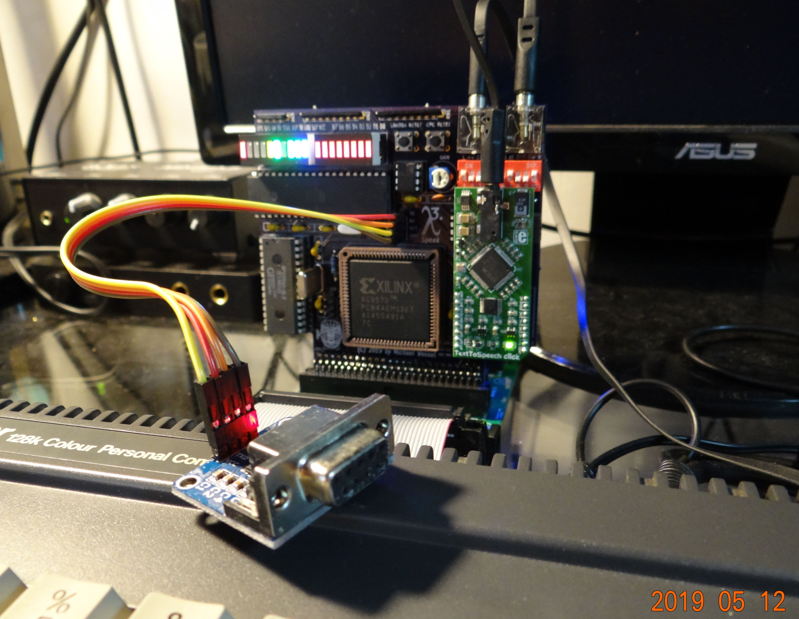

There is a simple `SERIAL.BAS` terminal program. If you only want to receive but not send, simply press Enter. Note that the input buffer size is 256 + 268 bytes only. The sender needs to pause and give the CPC time to read the received bytes via the read cursor from the buffer, otherwise received bytes will get lost.

The Serial Mode is using the standard READY indicator - if `32` appears on port `&FBEE`, then this means that LS3 is ready to receive the next command, or the next command argument.  

In order to receive data from LS3 in Serial Mode, a special protocol is being used: in order to send `<byte>` to the CPC, LS3 first puts `<byte>` on port `&FBEE`, then either waits for 10 us, 50 us, or for 20 ms, depending on whether fast getters, medium getters, or slow getters are being used (see table below); next, `0` appears on `&FBEE`, for the same amount of waiting time, until a 32 (READY indication) signals that LS3 is ready to receive the next command. 

Please have a look at the BASIC program `SERIAL.BAS` (a simple bi-directional terminal program in BASIC) on the `LS300.DSK` for an illustration of how to send and receive data with LS3 in Serial Mode. 

The supported BAUD rates and configurations can be found [here.](uart-loop.c).  

##### The 4 $ Catalex MP3 Module 

You can get it on Ebay for 4 USD. There is a demo program `MP3.BAS` on the 
[`LS300.DSK`](cpc/lambda/LS300.dsk). 

The MP3 directories and filenames on the micro SDCard to be played needs to follow certain conventions, check [the manual](manuals/Catalex_MP3_board.pdf). I successfully used it with an 8 GB FAT32 formatted SD card with a single root directory "01" and a couple of MP3 files named "001xxx.mp3" to "009xxx.mp3". There are certainly more possibilities for naming, but that worked for me.

Please note that TX-RX and RX-TX is required for the Catalex MP3 Module. 

##### MIDI Boards  

I have successfully connected the 8 $ [ubld.it Midi Breakout board](https://ubld.it/products/midi-breakout-board/), and other MIDI boards should work without problems as well.
Please note that TX-TX and RX-RX is required for the ubld.it board.  LambdaSpeak 3 supports BAUD mode 6, which configures it for 31250 BAUDs as required for MIDI (and 8N1 is standard setting already). 

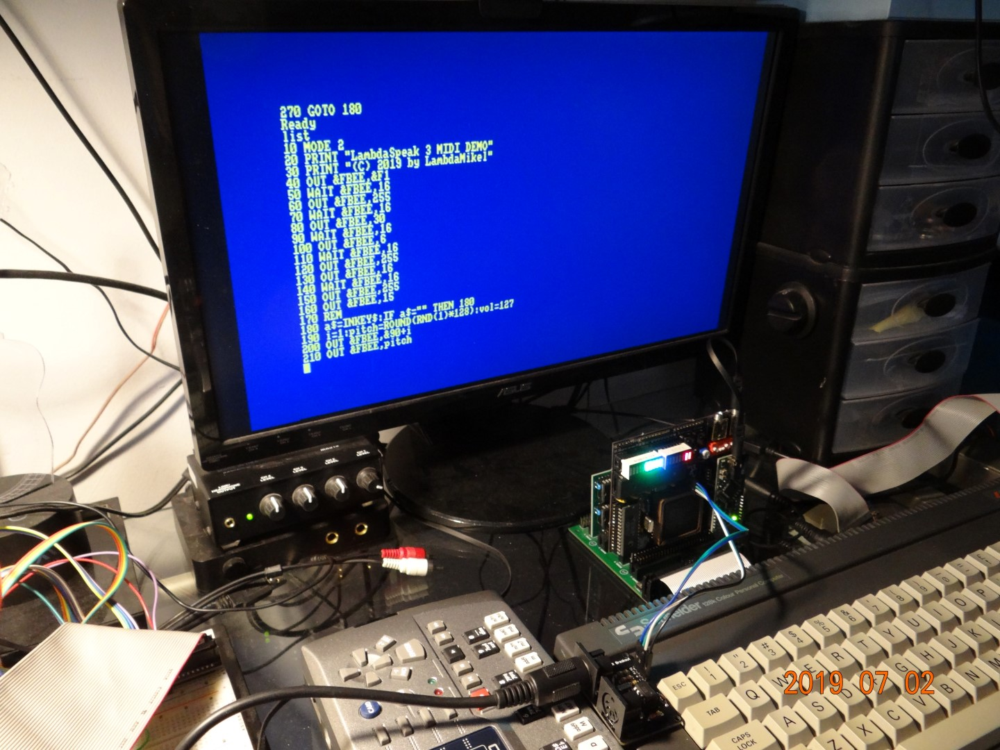

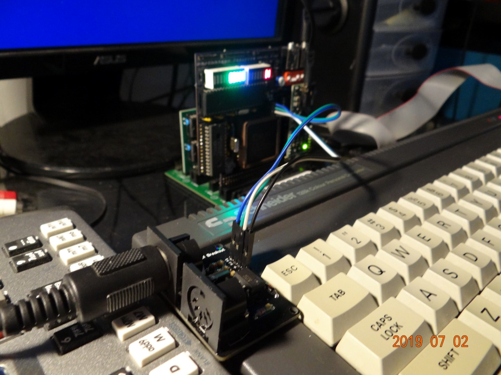

MIDI OUT is easy to achieve either using the Serial Direct Mode, or the Buffered Mode, and even BASIC is sufficient. For simple MIDI OUT message sending from BASIC, please have a look at the `MIDIOUT.BAS` program on the [`LS300.DSK`](cpc/lambda/LS300.dsk) disk. 

However, for MIDI IN, an assembler / Z80  machine code program is required, and **LambdaSpeak 3 offers two special high-speed serial sub-modes for realtime processing of serial / MIDI messages.** These sub-modes are 
  - sub-mode 10 and 
  - sub-mode 50. 

These sub-modes are enabled from **within** the serial mode by by sending the sequence `&FF`, `10` and `&FF`, `50`, respectively. **When enabled, these modes run their own message dispatching / listener loops, which are different from the serial mode loop, and also different from the main loop.** 

Sub-mode 10 is for serial (MIDI IN) input only, whereas sub-mode 50 works in both directions -- input and output (full duplex; MIDI IN / MIDI OUT). 
The former sub-mode runs slightly faster, and the communication protocol with the CPC is less complicated. 

The **protocol for sub-mode 10** works as follows: 

1. The CPC sends an arbitrary `<byte>` via `OUT &fbee,<byte>`. The `<byte>` does not matter here and is only used as a  a synchronization and handshake signal. 
2. LambdaSpeak 3 indicates if a byte is available in the UART receive buffer (i.e., something has been received via UART RX which has not been transmitted to the CPC yet), by either putting `0` or `1` on the databus. The CPC now reads from port `&FBEE` via `INP(&fbee)`: 
   - If `1` is found, then a byte is available: 
     - The CPC must now request / retrieve the byte from LambdaSpeak 3, by sending another arbitrary byte to port `&FBEE`. 
     - The next available byte from the receive buffer will now become available at port `&FBEE` for the CPC to read using `INP(&FBEE)`.  
     - Goto 1. 
   - Else, `0` is found. No byte is available. 
     - Goto 1. 

The protocol is best understood by looking at the provided example MAXAM assembler / machine code programs on the [`LS300.DSK`](cpc/lambda/LS300.dsk) disk: 
the MAXAM assembler / machine code program `MIDISYN.BAS` implements a simple MIDI IN CPC Synthesizer that turns received MIDI NOTE ON / NOTE OFF messages into CPC sounds / notes being played by the CPC's GI AY-3-8912 soundchip. So, you turn the CPC into a MIDI sound module that can be played from any standard MIDI keyboard. 

The **protocol for sub-mode 50** is a bit more involved, as it requires bi-directional communication. This mode uses the following communication protocol: 

1. The CPC sends a `<byte>` for serial transmission via the UART TX / MIDI OUT, using `OUT &fbee,<byte>`. In case it has nothing to transmit, the CPC can send the sequence `255`, `0`. 
2. LambdaSpeak 3 processes the received `<byte>`. 
   - If `<byte>` = `255`, then this indicates a **command byte**, and now a **second byte** is expected by LambdaSpeak 3.  
     - The CPC sends the second byte, `<byte2>`, using `OUT &fbee,<byte2>`. 
       - If `<byte2>` = `255`, then `255` is transmitted via the UART TX.   
       - If `<byte2>` = `20`, then the Serial Monitor sub-mode exits, and LambdaSpeak 3 returns to the normal Serial Mode. 
       - Else, `<byte2>` is being ignored.  Goto 3 (below). 
   - If `<byte>` is unequal `255`, then `<byte>` is being transmitted via UART TX. 
3. Next, LambdaSpeak 3 indicates if there is a byte available in the UART receive buffer (i.e., something has been received via UART RX which has not been transmitted to the CPC yet), by either putting `0` or `1` on the databus. The CPC reads from port `&FBEE`: 
   - If `1` is found, then a byte is available: 
     - The CPC must now request / retrieve the byte from LambdaSpeak 3, by sending an arbitrary byte to output port `&FBEE`. This acts as a synchronization and handshake signal; the sent byte does not matter here. 
     - The byte will now become available on port `&FBEE` for the CPC to read using `INP(&FBEE)`. 
     - Goto 1. 
   - Else, `0` is found. No byte is available.
     - Goto 1. 

Again, the protocol is best understood by looking at the provided
example MAXAM assembler programs on the
[`LS300.DSK`](cpc/lambda/LS300.dsk) disk; the MAXAM assembler /
machine code program `MIDISYNX.BAS` is an extension of the CPC MIDI
synthesizer discussed above. In addition to playing the sounds /
notes, it will also use the protocol above to "echo back" the received
MIDI IN messages to the TX pin, hence MIDI OUT messages. This
implements a "soft" MIDI THRU, where the CPC implements the MIDI THRU
functionality over the MIDI OUT (TX) port. 

#### I2C Mode 

Currently, only the RTC module is supported. It is conceivable that an alternative firmware will be supplied in the future such that the I2C interface can be opened up to the CPC, in a generic way such that different I2C devices can be connected to LambdaSpeak 3 and hence the CPC. 

##### The 6 $ DS3231 RTC (Battery Buffered Real Time Clock) 

You can get it on Ebay for 6 USD. The RTC also features a temperature sensor, in (C) degrees.  Not sure how to read negative temperatures though. Please check [the manual](manuals/DS3231.pdf). 

The LambdaSpeak 3 firmware supports the RTC directly. Designing a more generic way of accessing and controlling arbitrary I2C devices, and corresponding I2C functions in the firmware, is still future work. 

Have a look at the control bytes / commands for retrieving the values of the different RTC register, i.e., `&D3` to `&D9`, and for retrieving the temperature via `&D2`. Reading out the clock registers is not easy though, and almost impossible from BASIC. Please have a look at the Z80 MAXAM Assembler program `ASMCLOCK.BAS` (required MAXAM ROM) for an illustration / demo of how to read out the clock registers reliably without glitches. There is also a BASIC program `RTC.BAS` which is still under construction and currently does not run reliably, because a piece of Z80 MC is missing for reading the RTC registers reliably. Will be updated soon. Read further for additional options to retrieve the time. 

**Please note that the clock functions can only be called from the Epson or DECtalk mode; if called from different modes, they will act as NO-OPs.**

After a call to retrieve a value (seconds, minutes, hours, ...) from the clock, say after a call to `&D5` to retrieve the seconds, the following happens:

1. 0 appears on the databus, indicating that LambdaSpeak 3 is busy calculating / retrieving the result from the RTC module. 
2. after a (non-deterministic, variable) few microseconds, the value of the RTC register appears on the databus, e.g., the requested number of seconds (minutes, hours, ...). 
3. after 20 ms, 50 us, or 10 us (depending on whether slow getters, medium, or fast getters are being used - see control bytes `&E4`, `&E0`, and `&E5`, resp.), the value 255 appears on the databus. This byte 255 acts as a synchronization byte. Since none of the clock registers can ever have the value 255, applications are supposed to sample the CPC data bus to realize that when 255 has been seen, the PREVIOUS byte on the databus was the actual requested value (e.g., the last value on the databus immediately BEFORE 255 was the number of seconds if `&D5` had been sent).     
4. after 20 ms, 50 us, or 10 us, 255 is replaced by 0, and LambdaSpeak 3 returns to its previous mode, indicating ready by putting 32 on the databus. 

The timing (repeatedly sampling of the databus to check for the byte 255 and remembering the previous databus value for the actual result) is extremely delicate, and even with slow getters (when the bytes appear for 20 ms on the databus) probably impossible to get right reliably with BASIC. Please have a look at `ASMCLOCK.BAS` or use TFM's RSX commands `|gettime`, `|getdate`, `|gettemp`, and the wonderful `|bigwatch` instead. 

#### LambdaSpeak 3 Programming 

Have a look at the BASIC programs. And here is a piece of Z80 Assembler that shows how to send a reset command to LambdaSpeak 3; see program `ASM.BAS` on the [`LS300.DSK`](cpc/lambda/LS300.dsk).  The program returns when the Native Mode READY indiciator has been received (= 128), i.e., the reset completed: 

~~~~
org #8000
.start
LD BC,#FBEE
LD A,#FF 
OUT (C),A
.loop1
IN A,(C) 
CP 128
JP NZ,loop1
RET
~~~~

#### Busy and Ready Indicators in the Different Modes

READY Indicators: 

--------------------------------------------------------------------------------------
| DECTALK | EPSON | SSA1 EMU | DK EMU | SSA1 SP0 | DK SP0 | SERIAL | EEPROM GET DATA |
|---------|-------|----------|--------|----------|--------|--------|-----------------|
|     32  |   32  |    128   |    0   |    128   | 255    |   16   |       32        | 
--------------------------------------------------------------------------------------

Note: there is a difference for DKtronics EMU and DKtronics SP0 mode -
but the existing software does not care. Only the BUSY indicator
matters. 

BUSY Indicators: soon. 

### The LambdaSpeak 3 Firmware 

Here are the firmware files:  

* [Xilinx XC9572 PLLC84 CPLD](firmware/xc9572/lambdaspeak3.jed)
* [ATmega 644 Firmware](firmware/atmega644/lambdaspeak3-firmware.hex)

For reference, the [Verilog](firmware/xc9572/lambdaspeak3.v) and
[Constraint](firmware/xc9572/lambdaspeak3.ucf) files are provided as well.

I have used the [ISE
WebPack](https://www.xilinx.com/products/design-tools/ise-design-suite/ise-webpack.html) under Ubuntu Linux and a generic Xilinx USB Platform Cable (clone) to program the CPLD. Note that LambdaSpeak 3 has JTAG headers on board. Power can be provided from the 5V jack (center polarity = +!) for programming. 

The ATmega can be programmed with an EPROM programmer such as the inexpensive USB TL866II which can be found on Ebay and/or Amazon for ~
30 USD. The fuse settings required for LambdaSpeak's 20 MHz external clock are shown in the following picture:

 
### Software

There are a couple of demo programs.

The main disk is called [`LS300.DSK`](cpc/lambda/LS300.dsk): 

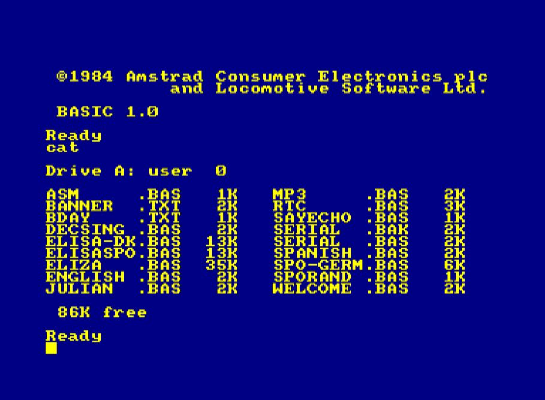 

-------------------------------------------------------------
| Program   | Description                                   |
|-----------|-----------------------------------------------|
| ASM       | Send Reset Command from Z80 MC Program.       |
| ASMCLOCK  | Z80 Clock - read RTC registers / show protcol.|
| BANNER    | DECSING DECTalk Song.                         |
| BDAY      | DECSING DECTalk Song.                         |
| DECSING   | Demo of DECtalk singing. Load BANNER or BDAY. |
| ELISA-DK  | A German-speaking Eliza using DK’tronics Emu. | 
| ELISASP0  | A German-speaking Eliza using DK’tronics SP0. | 
| ELIZA     | High-End English Eliza, Natural Epson Speech. | 
| ENGLISH   | Demo of English-speaking Epson mode.          | 
| EEPROM2   | Test of EEPROM upload and download mode.      | 
| EEPROM3   | Test of EEPROM upload and download mode.      | 
| EEPROM4   | Test of EEPROM upload and download mode.      | 
| JULIAN    | Simultaneous speech and MP3 music playing.    | 
| MIDIOUT   | Simple random note MIDI OUT demo.             | 
| MIDISYN   | MAXAM Z80 CPC MIDI IN Synthesizer demo.       | 
| MIDISYNX  | Like MIDISYN, but with MIDI OUT "Soft Thru".  | 
| MP3       | Simple MP3 play for the Catalex module.       | 
| RTC       | Simple Real Time Clock; uses DS3231 module.   | 
| SAYECHO   | Simple Epson-based "say what I type" program. | 
| SERIAL    | Simple terminal prog. Use with FTDI or RS232. | 
| SAYTEMP   | Speak the current temperature in C degrees.   | 
| SPANISH   | Demo of Spanish-speaking Epson mode.          |
| SP0-GERM  | SP0-based German "say what I type" program.   |
| SP0RAND   | Random SP0 babbling. SP0 test and sounds cool.|
| WELCOME   | Demonstrates Epson, DECtalk, Control Bytes.   | 
------------------------------------------------------------- 

Notice that the Software Distribution provided by TFM contains more examples, also illustrating the RSX driver software.

Then, there are also 2 sample disks demonstrating LambdaDrum / 
the Autonomous PCM Playing Mode. 

First, the [`HIDEFSEQ1.DSK`](cpc/lambda/hidefseq1.dsk) contains high  quality PCM samples of the Boss DR660 drum computer and demo: 

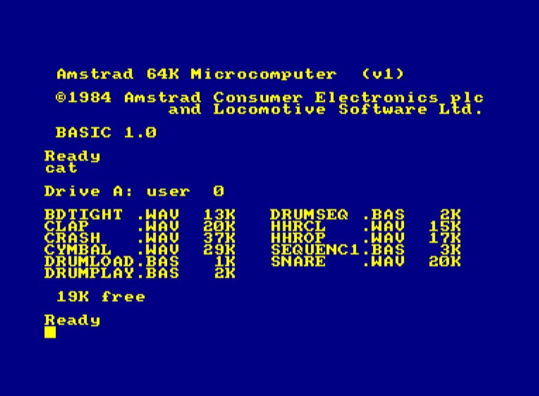

---------------------------------------------------------------
| Program   | Description                                     |
|-----------|-------------------------------------------------|
| DRUMLOAD  | Load the PCM samples from disk into EEPROM.     |
| DRUMLD2   | Dito, but with MUCH FASTER |PCMUP from LS3 ROM. |
| DRUMPLAY  | A drum computer - DRUMLOAD or DRUMLD2 first!    |
| DRUMSEQ   | A simple patter-based drum computer.            | 
| *.WAV     | Boss DR660 Wave Files (LARGE - High Quality).   |
---------------------------------------------------------------  

A larger set of drums in slightly lower PCM (medium) quality is on the disk [`MIDEFSEQ2.DSK`](cpc/lambda/midefseq2.dsk):

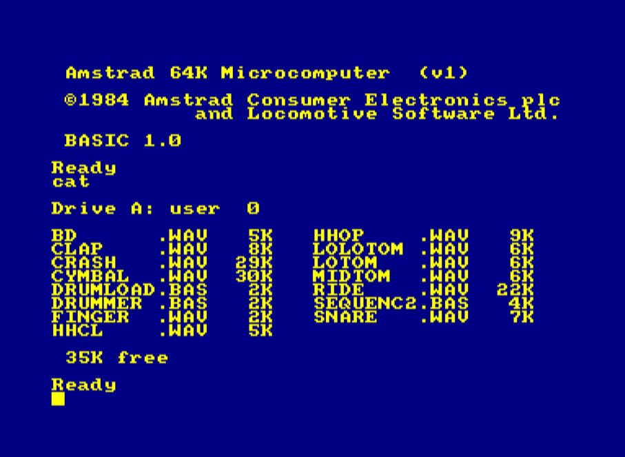

---------------------------------------------------------------
| Program   | Description                                     |
|-----------|-------------------------------------------------|
| DRUMLOAD  | Load the PCM samples from disk into EEPROM.     |
| DRUMLD2   | Dito, but with MUCH FASTER |PCMUP from LS3 ROM. |
| DRUMMER   | A drum computer - DRUMLOAD or DRUMLD2 first!    |
| DRUMMER2  | Dito, but uses |PCMPLAY commands from LS3 ROM.  |
| SEQUENC2  | A patter-based drum computer, with SP0 track.   |  
| *.WAV     | Boss DR660 Wave Files (SMALL -Medium Quality).  |
---------------------------------------------------------------

#### A Note on Preparing Sample (WAV) Files 

I am using the following tool chain to prepare 8Bit PCM WAV files: 

1. Download WAV files from the internet, e.g. Boss DR660 drum files. 
2. Load into Audacity. Normalize,  edit, cut, fade, ... 
3. Use "Export...", select "Export as WAV". For file type, Select "Other Uncompressed Format". Select "WAV" and "Unsigned 8-bit PCM". Save the file. 
4. The WAV file still contains header information which, if played by LambdaSpeak, causes hissing and other artefacts. To remove the header information from the file, I found the program `riffstrip.exe` is doing a great job (a simple command line tool). 
5. Now simply drop the WAV files onto a CPC DSK (e.g., using Markus Hohmann's `DSKTool.jar`
or similar). 

#### LambdaSpeak |RSX Driver and ROM by Dr. Stefan Stumpferl (aka TFM, Gunhed)

[TFM](http://futureos.cpc-live.com/pics/tfm_gr.jpg), well-known in the CPC Community for his [FutureOS operating system for the CPC](http://futureos.cpc-live.com/), has created an awesome |RSX driver for LambdaSpeak. It comes in two versions - as a ROM, and as a disc-based relocatable driver (loadable from BASIC). |RSX commands exists for all LambdaSpeak control bytes, and also some high-level functions are offered that do not directly correspond to LambdaSpeak control bytes. For example, a PCM sample `|play` command (and `|eplay` for playing from an extended memory extension) for LambdaSpeak's Amdrum mode is offered, as well as a `|speakscreen` screen reading and a `|speakfile` file reading function. There are also commands for the EEPROM-based PCM sample player, see `|pcmup`, `|pcmmode`, and `|pcmplay`. Moreover, the MP3 player module is supported with a whole bunch of commands, as well as the talking Real Time Clock!  

Here is a picture of the LambdaSpeak 3 ROM; `|lshelp` command: 

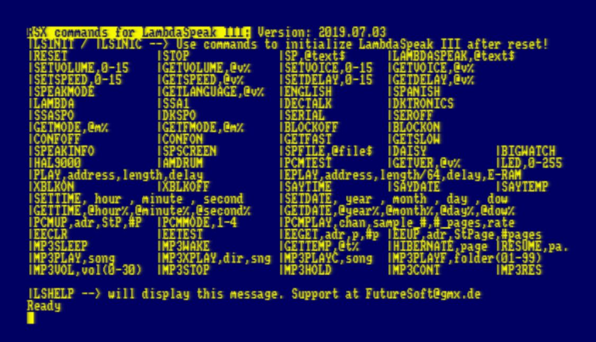

The latest version of the [LambdaSpeak driver software is hosted on TFM's home page](http://futureos.cpc-live.com/files/LambdaSpeak_RSX_by_TFM.zip). The zip file also contains an extensive manual describing all features of the software, as well as the `LS3.ROM` file. 

TFM also created a [documentation page on the German CPC Wiki for the LS3 ROM!](http://www.cpcwiki.eu/index.php/LambdaSpeak_III_ROM) 

**TFM is continuously updating his library and documentation - stay
tuned, and frequently check his site and the German CPC Wiki for
updates!  This is where you will also find the ROM and the
documentation for this fantastic piece of CPC software! Again, many
Cudos to TFM for making it!!**

### Maker Support 

The Gerbers and Firmware and all specs (BOM, ...) are all open source and in principle you can build one yourself. However, if you require certain parts or a pre-programmed Xilinx CPLD, ATmega, or even a fully assembled
LambdaSpeak 3, please contact me. 

### Acknowledgements

TFM (Dr. Stefan Stumpferl) for the RSX driver and CPC ROM, ideas, enthusiasm, friendship! 

Julian ("zhulien" from the CPC Wiki Forum) for suggesting the Amdrum mode, incorporating the MP3 module, enthusiasm and support! 

Bryce, for guiding and pushing me into the right direction - Xilinx CPLD instead of GAL22V10, Verilog instead of WinCupl, countless discussions, etc.  

ChinnyVision, for [reviewing a previous version of LambdaSpeak on his YouTube channel.](https://youtu.be/yAZAAMu1DfA)

And, last but not least, the CPC users that have purchased  LambdaSpeak cards and hence made the development of LambdaSpeak 3 possible! 

Thanks to all of you, long live the CPC! 

### Disclaimer 

Use at your own risk. I am not responsible for any potential damage you might cause to your CPC, other machinery, or yourself, in the process of assembling and using this piece of hardware.

**Enjoy!** 

