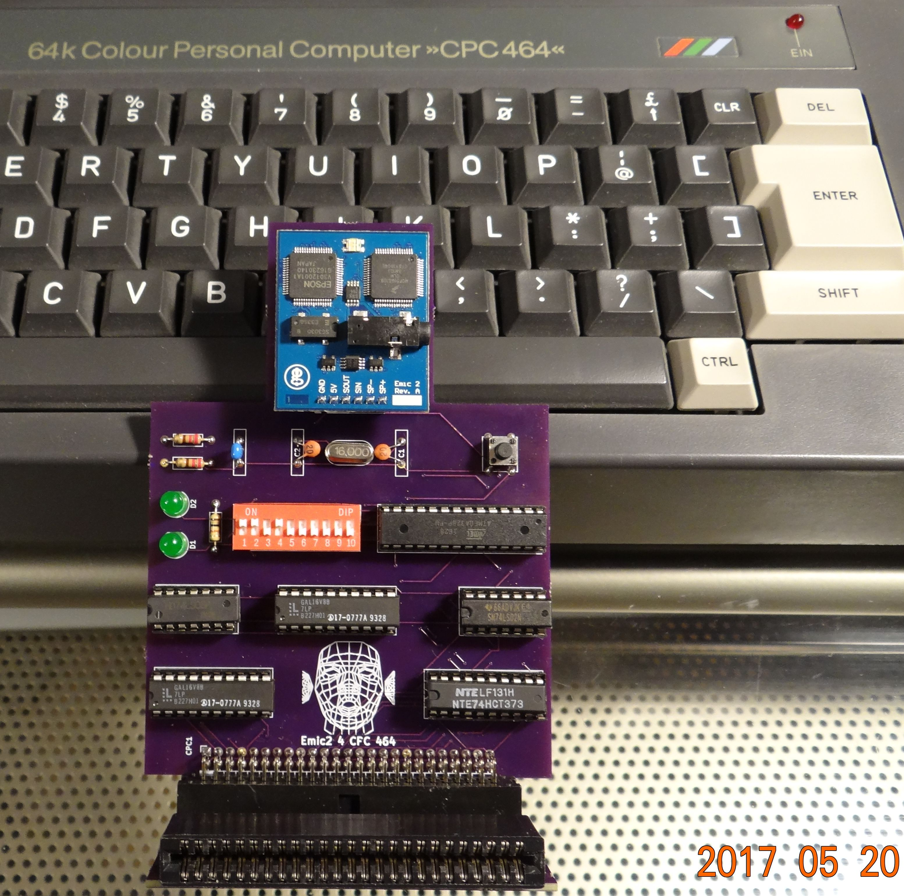
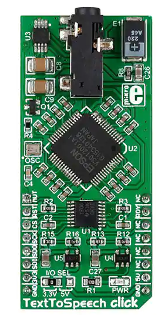
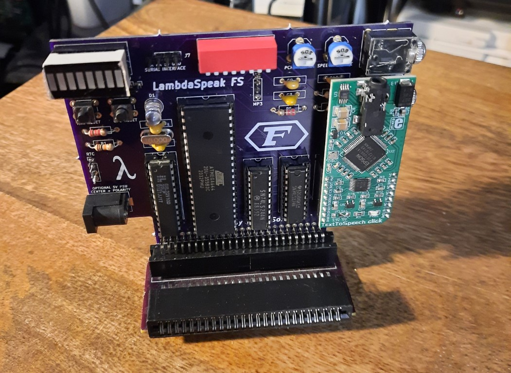
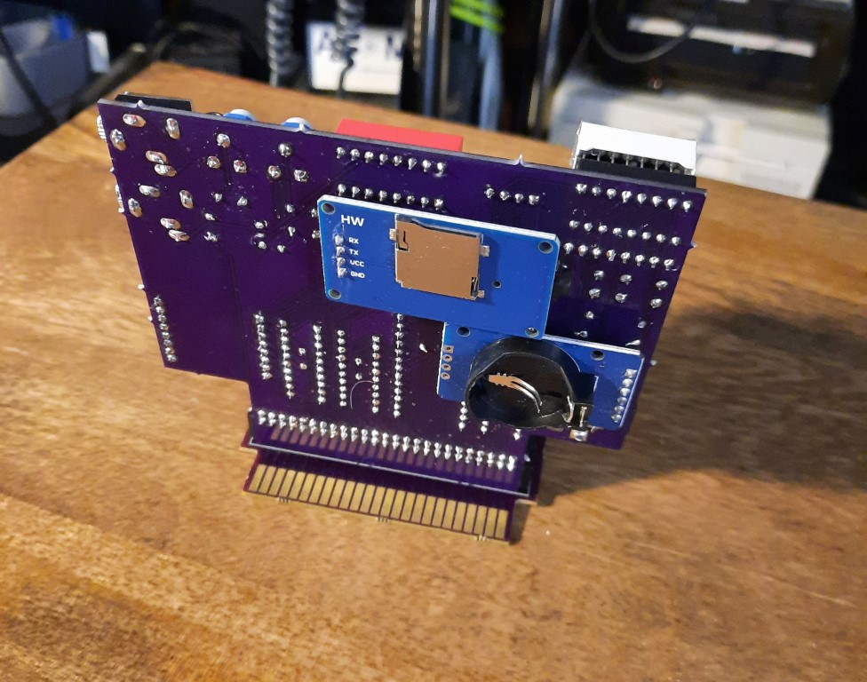
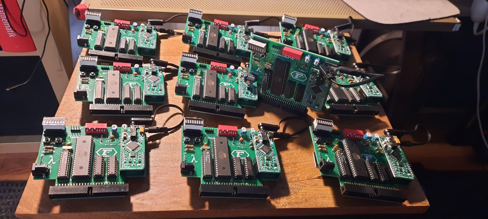

# LambdaSpeak History 

*This is an article which was invited by the Editor of the "Amstrad CPC
UsACUC (Amstrad CPC User Club Magazine)", Dr. CPC. Unfortunately, the
fanzine no longer exists and the article never got publish, so I
thought I put it up here.*

My [(LambdaMikel's)](https://hackaday.io/projects/hacker/138722)
fascination with speech synthesis started in the early 80s, and was
likely ignited and then nourished by movies such as ["Colossus - The
Forbin Project"](https://youtu.be/kyOEwiQhzMI),
["2001"](https://youtu.be/oR_e9y-bka0), and
["Wargames"](https://youtu.be/TQUsLAAZuhU).

When I got my [Schneider CPC 464 with CTM 640 Color
Monitor](articlepics/mycpc.jpg) for my confirmation in April 1985, the
first hardware extension that I acquired in July 1985 was the freshly
released ,
containing the infamous **SP0256-AL2 speech chip** used in so many
speech synths of that time. Soon it gave the "Eliza" program from
[David H. Ahl's "BASIC Computer
Games"](https://en.wikipedia.org/wiki/BASIC_Computer_Games) a voice,
and it could even speak German (albeit with strong American accent)!

Whereas the DK'tronics was certainly a cherished item, I was
nevertheless a bit disappointed by the SP0256-AL2's limited
capabilities. The speech quality was lacking and too monotone and
robotic for my taste, and, of course, no match for HAL 9000... but
even in comparison to the computer voice in "Wargames" (I later
learned that the Wargames computer speech synth wasn't real
either). Also, it certainly didn't help the SP0256-AL2's performance
that DK'tronics made a serious design simplification - the SP0
requires a proper 3.12 MHz clock and hence extra crystal for proper
operation, but to save some pennies, DK'tronics decided to omit the
crystal and used the CPC's 4MHz clock instead. This resulted in a
speech pitch and allophone speak rate that was 22% too high, severely
damaging voice clarity. Later, Amstrad would release the SSA-1
using the same chip, but with the extra crystal. In comparison, the
SSA-1 sounds much better than the DK’tronics indeed.

Overall, I wondered if maybe one day, I could design a more natural
sounding voice synthesizer for the CPC that sounded as good as
HAL-9000! One day...  Fast forward 30 years, I started tinkering with
Arduinos, and one day came across the Emic-2 speech synthesizer
module. It's quality of speech blew me away - finally, natural
sounding speech from a compact little unit! I realized that this unit
was the key to realizing my dream from the 80s. We could now build a
natural sounding speech synthesizer for the CPC that would sound as
good as HAL-9000! I learned that the Emic-2 was using an Epson
S1V30120 DSP (Digital Signal Processor) running the legendary DECtalk
speech synthesizer software, and that it could even sing!

 And, sure enough, in May
2017, I released the first version of LambdaSpeak using the
Emic-2. Emic-2 was controlled over a serial interface from an Atmega
328p (Arduino Uno R3) microcontroller chip. In addition, a bunch of
glue logic was used, including two GAL 16V8 for address decoding, some
combinational logic (74LSxxx gates) for databus handling, etc. Later
versions also included a loudspeaker and were designed so to not block
the display of my beloved DDI-3 interface on my CPC 464. I was just
having fun.

However, Emic-2 was (too) pricey, my first designs were too clunky,
and so I was looking for an alternative. Realizing that the Emic-2 was
centered around the **Epson S1V30120 DSP**, I found a module which was
only half the price, and which became the heart of all future
LambdaSpeak designs: the Text2Speech "Click!" board from
MikroElektronika.  

In order to use it, I had to switch to a more powerful
microcontroller, for which I chose the Atmega 644 with 64 KB of
program memory. The 32 Kbs found in the ATmega 328p were no longer
sufficient to store the S1V30120’s firmware image including the
DECtalk software (previously, the Emic-2 had done this for me, but now
I needed to do it myself).

Whereas the original focus of LambdaSpeak was to provide natural
sounding speech, it dawned me that it would also be nice if the
original DK'tronics and SSA-1 synthesizers could be emulated so that
existing speech synth software and games would run with LambdaSpeak. I
hence worked out a mapping from SP0256-AL2 "allophones" to DECtalk
phonemes, and how to emulate the SP0's hardware pins to fool the
software into thinking that an SSA-1 or DK'tronics was connected to
the CPC whereas in fact there was a LambdaSpeak. Finally, in February
2018, DK'tronics and SSA-1 emulation was working well enough so that
all existing SSA-1 (DK'tronics) software would run with
LambdaSpeak. LambdaSpeak 1.5 was born, and I started to sell a few
units to like-minded CPC enthusiasts.

The first LambdaSpeak customers started to make feature requests. For
example, Zhulien from the CPC Wiki EU Forum suggested the "Amdrum
emulation mode". This mode turns LambdaSpeak into an 8bit,
high-quality PCM sample player, and the original Amdrum drum computer
software sounds as good (if not better) with LambdaSpeak as with the
original Amdrum hardware. Later, TFM ported Prodatron's Digitracker
(8Bit PCM Sound Tracker) to Amdrum mode as well.

At some point, Bryce from the CPC Wiki EU Forum also provided some
guidance and ideas; for example, he reviewed one of my earlier designs
and suggested some improvements. He also recommended to replace the 2
GAL’s and remaining glue 72LSxxx glue logic with a single Xilinx CPLD
(Complex Programmable Logic Device, similar to an FPGA) to reduce the
chip count and hence costs. Thanks to Bryce, I started to learn
Verilog and familiarized myself with CPLDs. A CPLD was used for
LambdaSpeak III (see below) and for some of my future projects (e.g.,
Speak&SID for the CPC).

TFM of FutureSoft joined the LambdaSpeak development team in early
2018 - whereas early versions of LambdaSpeak only came with a set of
primitive BASIC demo programs and the original SSA-1 and DK'tronics
software, TFM now started to develop a full-fledged and
feature-complete expansion ROM containing dozens of RSX commands,
truly unleashing its full potential (see TFM’s article in this issue
for more details!)  After a number of revisions, LambdaSpeak 1.95 was
the first feature-complete and stable version of which about 20 units
were sold in 2018, and which now came with TFM’s sophisticated RSX
software. Here is a picture of LambdaSpeak 1.95 with TFM's RSX ROM in
ToTO's Xmem. 

Whilst selling LambdaSpeak 1.95, I completely redesigned the hardware
and replaced the combinational logic with a single powerful Xilinx
XC9572 PLLC84 CPLD. More and more features were added, eventually
culminating in the release of LambdaSpeak III in March 2019. A
highlight of LambdaSpeak III was a socket for the original SP0256-AL2,
as a second speech chip option! With the original SSA-1 / DK'tronics
speech chip on board, LambdaSpeak III is also a modern
re-implementation of these classic speech synths, not only an
emulation. With a SP0256-AL2 on board it sounds exactly like the
originals, and it also has the proper 3.12 MHz crystal. However, the
SP0256-AL2 is optional and can be difficult to source, so without it,
you will still get the DECtalk-based SP0 emulation. Here is a picture
of LS III with SP0 and 3.12 MHz crystal in the bottom left corner.

Eventually, the final versions of LambdaSpeak III featured:
- natural sounding DECtalk speech synthesis that puts HAL 9000 to shame, supporting English and Castilian Spanish, 
- the SP0256-AL2 emulation, 
- an optional SP0256-AL2 as a second speech chip option - if present, LambdaSpeak III is also a SSA-1 and DK'tronics re-implementation that sounds and behaves exactly like the originals, not only an emulation; 
- the Amdrum PCM sample playing mode, 
- 128 KBs of (SPI) EEPROM providing arbitrary persistent data storage - it's main purpose is to act as PCM sample memory for the 
- 8bit hiqh-quality PCM sample player mode, realizing 4-channel PCM sound of unheard quality on the CPC; this mode differs from the Amdrum PCM mode in that the CPC does not have to stream the PCM sample data, but the data is coming from the EEPROM on board of the LS 3, and that it can be played back autonomously by LambdaSpeak with a command issued from the CPC, hence greatly reducing load on the CPC side; 
- a general purpose serial interface which can be used to control, for example, a serial MP3 player, a MIDI interface breakout board; and finally, 
- a DS3231 real-time clock with temperature sensor (connected via the I2C protocol).

However, LambdaSpeak III turned out to be pricey as well (in the 120 €
range with SP0-256AL2 chip!), and sales had been slow. Given both
TFM's as well as LambdaMikels huge time and financial investment in
developing it, TFM suggested in November 2020 to improve the situation
by bringing "LambdaSpeak to the masses, not the classes" - the idea to
develop a much more affordable "cost-down" version was born. Hence,
the SP0256-AL2 option as well as the EEPROM and extended PCM sample
playing modes were dropped, and the MP3 and RTC modules were added as
they were received more favorably than the SP0256-AL2 and EEPROM
options by customers. LambdaSpeak "FutureSoft Edition", or LFS for
short, was born!  The slightly reduced capabilities of LFS made a
massively cost-reduced hardware possible - the expensive (and
increasingly difficult to source) Xilinx CPLD was replaced by a single
22V10 GAL for address decoding, accompanied by the same ATmega 644
microcontroller, and a 74LS374 flip flop in tandem with a 74LS244 line
driver for CPC databus management. LambdaMikel designed the LFS
hardware over the Thanksgiving weekend 2021, and delivered a first
prototype to TFM in December 2021.

TFM started refactoring the ROM software. Finally, the first batch of
10 LFS was shipped to TFM for distribution in January 2021.
Eventually, TFM took on production of further units, continued to
develop the ROM software, provided customer support, shipping, and
spread the word in the CPC Community.

At the time of this writing, TFM is the sole point of contact for all
LFS-related issues, including sales.  So, join the future of speech
synthesis, and give your CPC a voice – get a LambdaSpeak FS from TFM!
And be sure to read TFM’s LambdaSpeak RSX ROM software description in
this issue as well. You can find a lot of information about
LambdaSpeak on GitHub – everything is OpenSource, including the
hardware & software, demo programs and videos, etc.

- [https://github.com/lambdamikel/LambdaSpeak-FS]([https://github.com/lambdamikel/LambdaSpeak-FS)
- [https://github.com/lambdamikel/LambdaSpeak3](https://github.com/lambdamikel/LambdaSpeak3)

*Sincerely yours,* 

**LambdaMikel, June 20th, 2022, Palo Alto, CA, USA** 

